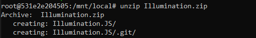
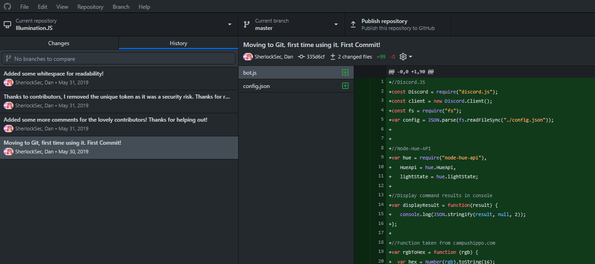
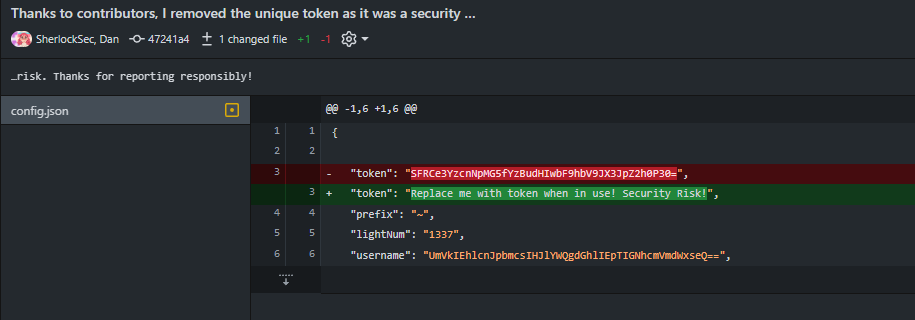

# HTB - Illumination.JS
> [Hackthebox](https://app.hackthebox.com) > Labs > [Challenges](https://app.hackthebox.com/challenges) > Forensics

## Challenge Description
A Junior Developer just switched to a new source control platform. Can you find the secret token?

## Files
* Illumination.zip (**pwd:** hackthebox)

## Step by Step
The challenge descriptions is talking about a new ``source control`` platform. That's a huge lead about what we are dealing with.

First, let's unzip the file:
```bash
unzip Illumination.zip
```


Inmmediately we realize that it extracts an `.git` folder. So, our first approach it's to check the commit history of this folder. You can do it with the git command `git log`. But why do I have to do this the "hacker way" if we have the right tools for the job. Just use Github for Desktop and import the folder.



At first sight we see 4 commits, the first one (moving to Git) sounds important.

We can see that the commit only added (green `[+]`) two files: `bot.js` and `config.json`. We directly check the second file, only to find the following content:

```json
{

	"token": "SFRCe3YzcnNpMG5fYzBudHIwbF9hbV9JX3JpZ2h0P30=",
	"prefix": "~",
	"lightNum": "1337",
	"username": "UmVkIEhlcnJpbmcsIHJlYWQgdGhlIEpTIGNhcmVmdWxseQ==",
	"host": "127.0.0.1"

}
```

We are getting close. If we decode `token` and `username`.

property | value | decoded value
--- | --- | ---
token | SFRCe3YzcnNpMG5fYzBudHIwbF9hbV9JX3JpZ2h0P30= | HTB{REDACTED}
username | UmVkIEhlcnJpbmcsIHJlYWQgdGhlIEpTIGNhcmVmdWxseQ== | Red Herring, read the JS carefully

We have found the flag `HTB{REDACTED?}`.

# Comments
This challenge is pretty easy (1 - Piece of Cake); Only took some knowledge on source control tools (git) and check the files that the challenge gave to us.

When you check the description of the challenge it's easy to see that the main lead was the `source control platform`. This inmediately rings bell to a __common mistake__ that developers make when they develop. They use hardcoded passwords within configurations or secret files and forget to put them in the `.gitignore` file. This usually leads to commit secrets or sensitive data along with their git history. Even if you "fix it" later with another commit (as you can see at commit `47241a4`), any person that has access to the `.git` folder it will be able to revert that fix and get the original data.



Happy hunting :)