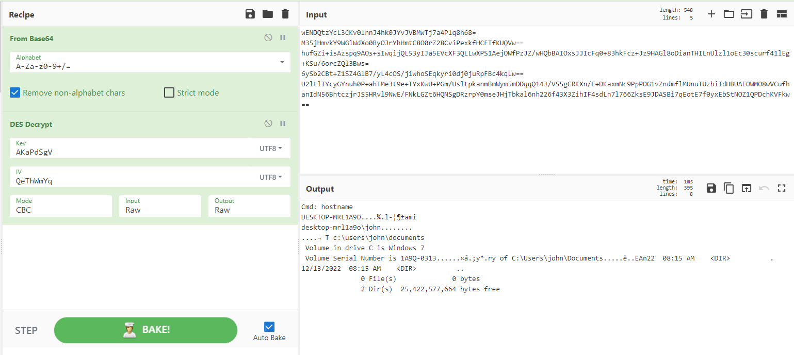

# HTB - TrueSecrets
> [Hackthebox](https://app.hackthebox.com) > Labs > [Challenges](https://app.hackthebox.com/challenges) > TrueSecrets

# Challenge Description
Our cybercrime unit has been investigating a well-known APT group for several months. The group has been responsible for several high-profile attacks on corporate organizations. However, what is interesting about that case, is that they have developed a custom command & control server of their own. Fortunately, our unit was able to raid the home of the leader of the APT group and take a memory capture of his computer while it was still powered on. Analyze the capture to try to find the source code of the server.

# Step by Step

### 1.- Understand the problem
We have a memory capture! Also, this APT has been developing their own C&C server. So there should be traces of their code or functionalities on this computer, secrets in memory, etc. Actually, there is a lot to find within memory. Lets start with some basic discoveries.

### 2.- Finding the profile
Since we have a memory dump, it's important to find the Volatility profile to work with it. This is fairly easy with the module imageinfo.
```bash
$ volatility -f TrueSecrets.raw imageinfo
Volatility Foundation Volatility Framework 2.6
INFO    : volatility.debug    : Determining profile based on KDBG search...
          Suggested Profile(s) : Win7SP1x86_23418, Win7SP0x86, Win7SP1x86
                     AS Layer1 : IA32PagedMemoryPae (Kernel AS)
                     AS Layer2 : FileAddressSpace (/home/mdiaz/HTBFiles/TrueSecrets.raw)
                      PAE type : PAE
                           DTB : 0x185000L
                          KDBG : 0x82732c78L
          Number of Processors : 1
     Image Type (Service Pack) : 1
                KPCR for CPU 0 : 0x82733d00L
             KUSER_SHARED_DATA : 0xffdf0000L
           Image date and time : 2022-12-14 21:33:30 UTC+0000
     Image local date and time : 2022-12-14 13:33:30 -0800
```

Let's choose the first profile as our predefined value: `Win7SP1x86_23418`.

### 3.- Analyzing the memory
Within a windows memory artifact we will find different types of interesting data that will help us to understand how the APT was developing this new C&C. Let us start by seeing what processes were running on the computer.

```bash
$ volatility -f TrueSecrets.raw --profile=Win7SP1x86_23418 pstree
Volatility Foundation Volatility Framework 2.6
Name                                                  Pid   PPid   Thds   Hnds Time
-------------------------------------------------- ------ ------ ------ ------ ----
 0x8e0d3a40:explorer.exe                             1464   1436     32   1069 2022-12-14 21:08:22 UTC+0000
. 0x8382f198:7zFM.exe                                2176   1464      3    135 2022-12-14 21:22:44 UTC+0000
. 0x83c1d030:DumpIt.exe                              3212   1464      2     38 2022-12-14 21:33:28 UTC+0000
. 0x91892030:TrueCrypt.exe                           2128   1464      4    262 2022-12-14 21:08:31 UTC+0000
. 0x83825540:VBoxTray.exe                            1832   1464     12    140 2022-12-14 21:08:22 UTC+0000
 0x8378ed28:System                                      4      0     87    475 2022-12-15 06:08:19 UTC+0000
. 0x83e7e020:smss.exe                                 252      4      2     29 2022-12-15 06:08:19 UTC+0000
 0x843cf980:csrss.exe                                 320    312      9    375 2022-12-15 06:08:19 UTC+0000
 0x837f6280:wininit.exe                               356    312      3     79 2022-12-15 06:08:19 UTC+0000
. 0x844577a0:services.exe                             452    356      9    213 2022-12-15 06:08:19 UTC+0000
.. 0x845fcd28:svchost.exe                             904    452     15    311 2022-12-14 21:08:21 UTC+0000
.. 0x8e10d998:svchost.exe                            1680    452     14    224 2022-12-14 21:08:22 UTC+0000
.. 0x8e1ef208:taskhost.exe                           2580    452      5     86 2022-12-14 21:13:01 UTC+0000
.. 0x8e1cd8d0:sppsvc.exe                              352    452      4    144 2022-12-14 21:08:23 UTC+0000
.. 0x844a2030:VBoxService.ex                          644    452     11    116 2022-12-15 06:08:19 UTC+0000
.. 0x84484d28:svchost.exe                             928    452     23    956 2022-12-14 21:08:21 UTC+0000
.. 0x8e030a38:svchost.exe                            1116    452     18    398 2022-12-14 21:08:21 UTC+0000
.. 0x84488030:svchost.exe                             584    452     10    347 2022-12-15 06:08:19 UTC+0000
... 0x83911848:WmiPrvSE.exe                          2332    584      5    112 2022-12-14 21:12:23 UTC+0000
.. 0x844ab478:svchost.exe                             696    452      7    243 2022-12-14 21:08:21 UTC+0000
.. 0x845f5030:svchost.exe                             864    452     16    399 2022-12-14 21:08:21 UTC+0000
... 0x844d2d28:dwm.exe                               1448    864      3     69 2022-12-14 21:08:22 UTC+0000
.. 0x8e0a2658:taskhost.exe                           1352    452      9    223 2022-12-14 21:08:22 UTC+0000
.. 0x8e0525b0:spoolsv.exe                            1228    452     13    275 2022-12-14 21:08:21 UTC+0000
.. 0x8e06f2d0:SearchIndexer.                          856    452     13    626 2022-12-14 21:08:28 UTC+0000
.. 0x8e1023a0:svchost.exe                            1636    452     10    183 2022-12-14 21:08:22 UTC+0000
.. 0x8e07d900:wlms.exe                               1776    452      4     45 2022-12-14 21:08:22 UTC+0000
.. 0x8e013488:svchost.exe                             992    452      5    114 2022-12-14 21:08:21 UTC+0000
.. 0x844c3030:svchost.exe                             752    452     18    457 2022-12-14 21:08:21 UTC+0000
.. 0x84477d28:svchost.exe                            1268    452     19    337 2022-12-14 21:08:21 UTC+0000
.. 0x8e1f6a40:svchost.exe                            1632    452      5     91 2022-12-14 21:08:23 UTC+0000
.. 0x91865790:svchost.exe                            2760    452     13    362 2022-12-14 21:10:23 UTC+0000
. 0x8445e030:lsass.exe                                468    356      7    591 2022-12-15 06:08:19 UTC+0000
. 0x8445f030:lsm.exe                                  476    356     10    142 2022-12-15 06:08:19 UTC+0000
 0x84409030:winlogon.exe                              396    348      3    110 2022-12-15 06:08:19 UTC+0000
 0x84402d28:csrss.exe                                 368    348      7    203 2022-12-15 06:08:19 UTC+0000
. 0x83c0a030:conhost.exe                              272    368      2     34 2022-12-14 21:33:28 UTC+0000
```

Here the following process should catch your eye:
* TrueCrypt.exe 
* 7zFM.exe

The first program is a known encryption tool and also, a [vulnerable one](https://thehackernews.com/2015/09/truecrypt-encryption-software.html). The second one its just 7zip file manager. So, at some point there was a decompression or compression of a folder or files.

A [file handle](https://learn.microsoft.com/en-us/windows/win32/fileio/file-handles) is created every time a file is opened via CreateFile function. So if at some point `7zFM.exe` openes a file it will have a handler in memory. We can use Volatility to list all handles by a process using its PID, which in this case is 2176.

```bash
$ volatility -f TrueSecrets.raw --profile=Win7SP1x86_23418 handles --pid=2176
Volatility Foundation Volatility Framework 2.6
Offset(V)     Pid     Handle     Access Type             Details
---------- ------ ---------- ---------- ---------------- -------
0x885d7e90   2176        0x4        0x3 Directory        KnownDlls
0x83959978   2176        0x8   0x100020 File             \Device\HarddiskVolume1\Windows\System32
[...]
0x83983fc0   2176      0x230      0x804 EtwRegistration
0x843f6158   2176      0x238   0x120089 File             \Device\HarddiskVolume1\Users\IEUser\Documents\backup_development.zip
0x918c5d70   2176      0x240   0x120089 File             \Device\HarddiskVolume1\Windows\System32\en-US\user32.dll.mui
```
That will display a list of all the files and registry keys this binary opened. Several are part of the nature of the binary itself, but you can see at the very end that a file named `backup_development.zip` was created in the user space. It sounds really interesting.

It is time to dump this file from the memory! In order to do this, we need to know in which part (offset) of the memory it is and then grab its contents. An important note here is that not all files are entirely loaded in memory, so there is no guarantee that this will work.

```bash
$ volatility -f TrueSecrets.raw --profile=Win7SP1x86_23418 filescan | grep backup_development.zip
Volatility Foundation Volatility Framework 2.6
0x000000000bbf6158      3      1 R--r-- \Device\HarddiskVolume1\Users\IEUser\Documents\backup_development.zip
```

The file offset is `0x000000000bbf6158`, let us use that offset to dump the file.

```bash
$ volatility -f TrueSecrets.raw --profile=Win7SP1x86_23418 -Q 0x000000000bbf6158 dumpfiles -D .
Volatility Foundation Volatility Framework 2.6
DataSectionObject 0x0bbf6158   None   \Device\HarddiskVolume1\Users\IEUser\Documents\backup_development.zip
SharedCacheMap 0x0bbf6158   None   \Device\HarddiskVolume1\Users\IEUser\Documents\backup_development.zip
```

This may generate up to [3 file types](https://learn.microsoft.com/en-us/windows-hardware/drivers/ddi/wdm/ns-wdm-_section_object_pointers) with the following file extensions:
extension | type 
---|---
img | ImageSectionObject
dat | DataSectionObject
vacb | SharedCacheMap

We are interested in the data file stream, so let us unzip the `file.None.0x839339d0.dat`
```bash
$ unzip file.None.0x839339d0.dat
Archive:  file.None.0x839339d0.dat
 extracting: development.tc
```

We have a TrueCrypt file!

### 4.- Opening the TrueCrypt file
To open a TrueCrypt file we need to use TrueCrypt first. You can get it from [here](https://www.truecrypt71a.com/downloads/). Once installed, let us try to open the file.


And of course, it's going to ask us for a password. Thankfully, passwords are also stored in memory. Only if we had a memory snapshot of the machine... Oh wait, we have one. Let us back to Volatility and use a Truecrypt discovery module named `truecryptpassphrase`.

```bash
$ volatility -f TrueSecrets.raw --profile=Win7SP1x86_23418 truecryptpassphrase
Volatility Foundation Volatility Framework 2.6
Found at 0x89ebf064 length 28: X2Hk2XbEJqWYsh8VdbSYg6WpG9g7
```

Very... anticlimactic, but anyways. Now we have our password and we can mount the `.tc` file.

### 5.- Inside TrueCrypt
We are getting closer, now we have access to the APT's encrypted folder. Inside this folder we have the following:

```bash
malware_agent/
├── AgentServer.cs
└── sessions
    ├── 5818acbe-68f1-4176-a2f2-8c6bcb99f9fa.log.enc
    ├── c65939ad-5d17-43d5-9c3a-29c6a7c31a32.log.enc
    └── de008160-66e4-4d51-8264-21cbc27661fc.log.enc

1 directory, 4 files
```

The file AgentServer.cs seems to be the C&C server this APT was using to receive connections from their victims. Between line 35 and 39 you can see that all sessions are being saved in an encrypted way in the sessions folder.

```C#
File.AppendAllText(@"sessions\" + sessionFile,
    Encrypt(
        "Cmd: " + cmd + Environment.NewLine + cmdOut
    ) + Environment.NewLine
);
```

And that the encryption functions, between line 43 and 60. Utilizes DES encryption with `AKaPdSgV` as key and `QeThWmYq` as iv. Also, that the data is converted to base64 after being encrypted. So in order to revert this process we need to:

* decode from base64
* decrypt DES using the key and IV

I created [this recipe](https://cyberchef.org/#recipe=From_Base64('A-Za-z0-9%2B/%3D',true,false)DES_Decrypt(%7B'option':'UTF8','string':'AKaPdSgV'%7D,%7B'option':'UTF8','string':'QeThWmYq'%7D,'CBC','Raw','Raw')) in cyberchef to do this easily.

Now that we have our decryptor ready, we can decode the sessions.



Aaand the flag is in one of these sessions. To not disclose I'm not going to tell you which one :)


# Wrapping up & Comments
This was a nice challenge to train Volatility and in-memory forensics skills. It helps the analyst to understand how to retrieve files and processes from a memory dump, and also warn about the dangers of in-memory passwords. Just take a look at what Mimikatz it is today. On my side, I think the thing that took most of my time was to remember volatility commands. It was a fun challenge for a Thursday evening.

**Takeaways**
* Keep your Volatility sheetcheat close.
* Have a prepared environment to forensics
* Always keep learning :)